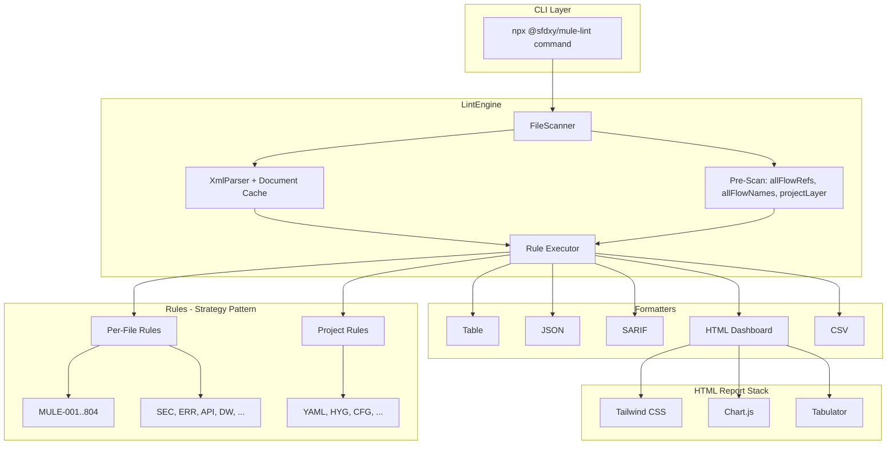
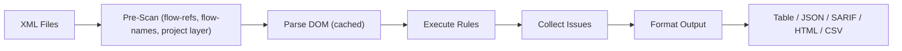

<p align="center">
  
</p>

<p align="center">
  <a href="https://www.npmjs.com/package/@sfdxy/mule-lint"></a>
  <a href="https://github.com/Avinava/mule-lint/actions"></a>
  <a href="https://github.com/Avinava/mule-lint/blob/master/LICENSE"></a>
  <a href="https://www.npmjs.com/package/@sfdxy/mule-lint"></a>
</p>

<p align="center">
  <strong>Enterprise-grade static analysis tool for MuleSoft applications</strong>
</p>

<p align="center">
  <a href="https://avinava.github.io/mule-lint/">Documentation</a> •
  <a href="#installation">Installation</a> •
  <a href="#quick-start">Quick Start</a> •
  <a href="#rules">Rules</a> •
  <a href="#output-formats">Output</a> •
  <a href="#configuration">Configuration</a> •
  <a href="#ai-agent-integration-mcp">MCP</a> •
  <a href="#extending">Extending</a>
</p>

---

## Overview

**Mule-Lint** is a TypeScript-based linting tool designed to enforce best practices and standards for MuleSoft applications. It provides:

- **82 Built-in Rules** covering error handling, security, naming, logging, performance, API-led, connectors, and more
- **Multiple Output Formats** - Table, JSON, SARIF, HTML, CSV
- **CI/CD Ready** - Exit codes and machine-readable output
- **457 Unit Tests** - Comprehensive test coverage for reliability
- **TypeScript** - Fully typed for VS Code extension integration
- **Extensible** - Add custom rules for your organization
- **Document Cache** - Parsed XML documents cached to eliminate redundant parsing
- **Project Layer Detection** - Automatic SAPI/PAPI/EAPI/library/batch classification

### Architecture


```mermaid
flowchart TB
    subgraph CLI["CLI Layer"]
        A[npx @sfdxy/mule-lint command]
    end

    subgraph Engine["LintEngine"]
        B[FileScanner] --> C[XmlParser + Document Cache]
        C --> D[Rule Executor]
        B --> PreScan[Pre-Scan: allFlowRefs, allFlowNames, projectLayer]
        PreScan --> D
    end

    subgraph Rules["Rules - Strategy Pattern"]
        D --> E[Per-File Rules]
        D --> F[Project Rules]
        E --> G[MULE-001..804]
        E --> H[SEC, ERR, API, DW, ...]
        F --> I2[YAML, HYG, CFG, ...]
    end

    subgraph Output["Formatters"]
        I[Table]
        J[JSON]
        K[SARIF]
        L[HTML Dashboard]
        M[CSV]
    end

    subgraph HTMLStack["HTML Report Stack"]
        L --> N[Tailwind CSS]
        L --> O[Chart.js]
        L --> P[Tabulator]
    end

    A --> B
    D --> I
    D --> J
    D --> K
    D --> L
    D --> M
```

### Data Flow


```mermaid
flowchart LR
    A["XML Files"] --> B["Pre-Scan (flow-refs, flow-names, project layer)"]
    B --> C["Parse DOM (cached)"]
    C --> D["Execute Rules"]
    D --> E["Collect Issues"]
    E --> F["Format Output"]
    F --> G["Table / JSON / SARIF / HTML / CSV"]
```

---

## Installation

```bash
# Global installation
npm install -g @sfdxy/mule-lint

# Or as a dev dependency
npm install --save-dev @sfdxy/mule-lint
```

---

## Quick Start

```bash
# Scan a directory
npx @sfdxy/mule-lint ./src/main/mule

# Scan a single file
npx @sfdxy/mule-lint ./src/main/mule/implementation.xml

# Output as JSON
npx @sfdxy/mule-lint ./src/main/mule -f json

# Output as SARIF (for AI agents/VS Code)
npx @sfdxy/mule-lint ./src/main/mule -f sarif > report.sarif

# Write to file
npx @sfdxy/mule-lint ./src/main/mule -o report.txt

# Fail on warnings (for CI/CD)
npx @sfdxy/mule-lint ./src/main/mule --fail-on-warning
```

### CLI Options

| Option                      | Description                                                               |
| --------------------------- | ------------------------------------------------------------------------- |
| `-f, --format <type>`       | Output format: `table`, `json`, `sarif`, `html`, `csv` (default: `table`) |
| `-o, --output <file>`       | Write output to file instead of stdout                                    |
| `-c, --config <file>`       | Path to configuration file                                                |
| `-q, --quiet`               | Show only errors (suppress warnings and info)                             |
| `-e, --experimental`        | **Enable experimental rules (opt-in)**                                    |
| `-g, --quality-gate <name>` | Apply quality gate: `default`, `strict`, or `config`                      |
| `--fail-on-warning`         | Exit with error code if warnings found                                    |
| `-v, --verbose`             | Show verbose output                                                       |

---

## Quality Gates

Quality gates provide pass/fail thresholds for your CI/CD pipelines. When a gate fails, the tool exits with code 1.

### Built-in Gates

| Gate      | Description                                                                                |
| --------- | ------------------------------------------------------------------------------------------ |
| `default` | Fails on errors or complexity > 20; warns on warnings > 10 or security vulnerabilities > 0 |
| `strict`  | Fails on errors, warnings, security vulnerabilities, or complexity > 10                    |

### Usage

```bash
# Apply default quality gate
npx @sfdxy/mule-lint ./src/main/mule -g default

# Apply strict quality gate
npx @sfdxy/mule-lint ./src/main/mule -g strict

# Use custom gate from config
npx @sfdxy/mule-lint ./src/main/mule -g config -c .mulelintrc.json
```

### Custom Gate Configuration

Add to your `.mulelintrc.json`:

```json
{
  "qualityGate": {
    "name": "Custom Gate",
    "conditions": [
      { "metric": "errors", "operator": ">", "threshold": 0, "status": "fail" },
      { "metric": "warnings", "operator": ">", "threshold": 5, "status": "warn" },
      { "metric": "complexity_max", "operator": ">", "threshold": 15, "status": "fail" }
    ]
  }
}
```

### Quality Ratings (A-E)

The HTML report displays quality ratings for four key dimensions. These follow industry-standard methodologies adapted for MuleSoft:

#### Complexity Rating

**What it measures:** Average cyclomatic complexity across all flows.

**Calculation:**

- Count decision points per flow: `choice/when`, `foreach`, `try`, `scatter-gather`, `async`, `until-successful`, `error-handlers`
- Base complexity = 1 + (total decision points)
- **Rating = Average of all flow complexities**

| Rating | Threshold | Interpretation                            |
| ------ | --------- | ----------------------------------------- |
| **A**  | Avg ≤ 5   | Simple, easy to test                      |
| **B**  | Avg ≤ 10  | Moderate complexity                       |
| **C**  | Avg ≤ 15  | Complex, consider splitting               |
| **D**  | Avg ≤ 20  | High complexity, refactor recommended     |
| **E**  | Avg > 20  | Very complex, critical refactoring needed |

#### Maintainability Rating

**What it measures:** Technical debt as a percentage of estimated development time.

**Calculation:**

- Debt minutes = (code smells × 5min) + (bugs × 15min) + (vulnerabilities × 30min)
- Development estimate = (flows × 10min) + (subflows × 5min), minimum 60min
- **Debt Ratio = (Debt minutes / Development estimate) × 100%**

| Rating | Debt Ratio | Interpretation                         |
| ------ | ---------- | -------------------------------------- |
| **A**  | ≤ 5%       | Excellent maintainability              |
| **B**  | ≤ 10%      | Good maintainability                   |
| **C**  | ≤ 20%      | Moderate technical debt                |
| **D**  | ≤ 50%      | High debt, plan remediation            |
| **E**  | > 50%      | Critical debt, immediate action needed |

#### Reliability Rating

**What it measures:** Number of bug-type issues detected.

**Bug-type rules:** All `error-handling` category rules are classified as bugs, including:

- Missing error handlers (MULE-003)
- Missing correlation ID (MULE-007)
- Generic error handling (MULE-009)
- HTTP status in error handlers (MULE-005)
- Global error handler (MULE-001)
- Try scope usage (ERR-001)

| Rating | Bug Count | Interpretation              |
| ------ | --------- | --------------------------- |
| **A**  | 0 bugs    | No reliability issues       |
| **B**  | 1-2 bugs  | Minor reliability concerns  |
| **C**  | 3-5 bugs  | Moderate reliability risk   |
| **D**  | 6-10 bugs | High reliability risk       |
| **E**  | > 10 bugs | Critical reliability issues |

#### Security Rating

**What it measures:** Security vulnerability count. Hotspots are reserved for externally enriched reports.

**Vulnerability rules:** All `security` category rules are classified as vulnerabilities, including:

- Hardcoded credentials (MULE-201)
- Insecure TLS (MULE-202)
- Plaintext secrets (YAML-004)
- Hardcoded URLs (MULE-004)
- TLS version check (SEC-002)
- Rate limiting (SEC-003)
- Input validation (SEC-004)

| Rating | Vulnerabilities | Interpretation                |
| ------ | --------------- | ----------------------------- |
| **A**  | 0 vulns         | Secure configuration          |
| **B**  | 1 vuln          | Minor security finding        |
| **C**  | 2-3 vulns       | Security review needed        |
| **D**  | 4-5 vulns       | Security remediation required |
| **E**  | > 5 vulns       | Critical security issues      |

### Examples

```bash
# Basic scan
npx @sfdxy/mule-lint .

# Scan with experimental rules
npx @sfdxy/mule-lint . --experimental

# Output SARIF for VS Code
npx @sfdxy/mule-lint src/main/mule -f sarif -o results.sarif
```

---

## Rules

### Core Rules (MVP)

| ID       | Name                  | Severity | Category       | Description                                                          |
| -------- | --------------------- | -------- | -------------- | -------------------------------------------------------------------- |
| MULE-001 | Global Error Handler  | Warning  | Error Handling | Any flow file should have a global error handler                     |
| MULE-002 | Flow Naming           | Warning  | Naming         | Flows end with `-flow`, sub-flows with `-subflow`                    |
| MULE-003 | Missing Error Handler | Error    | Error Handling | Flows should have error handlers                                     |
| MULE-004 | Hardcoded URLs        | Error    | Security       | Use property placeholders for URLs                                   |
| MULE-005 | HTTP Status Check     | Warning  | Error Handling | Error handlers should set httpStatus (skipped for non-HTTP projects) |
| MULE-006 | Logger Category       | Warning  | Logging        | Loggers should have category attribute                               |
| MULE-007 | Correlation ID        | Warning  | Error Handling | Error handlers should reference correlationId (checks DWL files too) |
| MULE-008 | Choice Anti-Pattern   | Warning  | Standards      | Avoid raise-error in otherwise                                       |
| MULE-009 | Generic Error Type    | Warning  | Error Handling | Avoid catching type="ANY"                                            |
| MULE-010 | DWL Standards         | Info     | Standards      | Standard DataWeave files should exist                                |

### Extended Rules

| ID       | Name                  | Severity | Category      | Description                                               |
| -------- | --------------------- | -------- | ------------- | --------------------------------------------------------- |
| MULE-101 | Flow Casing           | Warning  | Naming        | kebab-case for flows                                      |
| MULE-102 | Variable Naming       | Warning  | Naming        | camelCase for variables                                   |
| MULE-201 | Hardcoded Credentials | Error    | Security      | Use `${secure::}`                                         |
| MULE-202 | Insecure TLS          | Error    | Security      | No insecure="true"                                        |
| MULE-301 | Logger Payload        | Warning  | Logging       | Don't log entire payload                                  |
| MULE-303 | Logger in Retry       | Warning  | Logging       | Avoid loggers in until-successful                         |
| MULE-401 | HTTP User-Agent       | Warning  | HTTP          | Include User-Agent                                        |
| MULE-402 | HTTP Content-Type     | Warning  | HTTP          | POST/PUT needs Content-Type (static, CDATA, or inline DW) |
| MULE-403 | HTTP Timeout          | Warning  | HTTP          | Set responseTimeout                                       |
| MULE-501 | Scatter-Gather        | Info     | Performance   | Limit parallel routes                                     |
| MULE-502 | Async Error           | Warning  | Performance   | Async needs error handling                                |
| MULE-503 | Large Choice          | Warning  | Performance   | Max 7 when clauses                                        |
| MULE-601 | Flow Description      | Info     | Documentation | Add doc:description                                       |
| MULE-604 | Missing doc:name      | Warning  | Documentation | Key components need doc:name                              |
| MULE-701 | Deprecated            | Warning  | Standards     | Detect deprecated elements                                |
| MULE-801 | Flow Complexity       | Warning  | Complexity    | Cyclomatic complexity threshold                           |
| MULE-802 | Project Structure     | Warning  | Structure     | Validate folder structure                                 |
| MULE-803 | Global Config         | Warning  | Structure     | global.xml should exist                                   |
| MULE-804 | Monolithic XML        | Warning  | Structure     | Split large XML files                                     |

### DataWeave & API-Led Rules

| ID      | Name              | Severity | Category  | Description                                          |
| ------- | ----------------- | -------- | --------- | ---------------------------------------------------- |
| DW-001  | External DWL      | Warning  | DataWeave | Externalize complex transforms                       |
| DW-002  | DWL Naming        | Info     | DataWeave | kebab-case for .dwl files (configurable exemptPaths) |
| DW-003  | DWL Modules       | Info     | DataWeave | Use common modules                                   |
| DW-004  | Java 17 DW Errors | Error    | DataWeave | Java 17 compatible error handling                    |
| API-001 | Experience Layer  | Info     | API-Led   | Experience API patterns                              |
| API-002 | Process Layer     | Info     | API-Led   | Process layer orchestration                          |
| API-003 | System Layer      | Info     | API-Led   | System layer connections                             |
| API-004 | Single SAPI       | Warning  | API-Led   | Single system per SAPI                               |

### Experimental Rules

| ID       | Name              | Severity | Category     | Description                       |
| -------- | ----------------- | -------- | ------------ | --------------------------------- |
| EXP-001  | Flow Ref Depth    | Info     | Experimental | Limit flow-ref chains             |
| EXP-002  | Config Naming     | Info     | Experimental | Connector config naming           |
| EXP-003  | MUnit Coverage    | Info     | Experimental | Check for MUnit tests             |
| YAML-001 | Env Files         | Warning  | Standards    | Environment YAML files            |
| YAML-003 | Property Naming   | Info     | Standards    | Property key format               |
| YAML-004 | Plaintext Secrets | Error    | Security     | Encrypt sensitive YAML properties |

### Modern Best-Practice Rules

| ID       | Name                   | Severity | Category       | Description                               |
| -------- | ---------------------- | -------- | -------------- | ----------------------------------------- |
| SEC-002  | TLS Version            | Error    | Security       | Detect deprecated TLS versions (< 1.2)    |
| SEC-003  | Rate Limiting          | Warning  | Security       | APIs should have rate limiting configured |
| SEC-004  | Input Validation       | Warning  | Security       | Incoming payloads should be validated     |
| LOG-001  | Structured Logging     | Info     | Logging        | Recommend JSON logger format              |
| LOG-004  | Sensitive Data Logging | Error    | Logging        | Detect PII/secrets in log statements      |
| ERR-001  | Try Scope              | Info     | Error Handling | Complex operations should use Try scope   |
| PERF-002 | Connection Pooling     | Warning  | Performance    | DB/HTTP should configure connection pools |

### Security and Integrity Rules

| ID      | Name                         | Severity | Category  | Description                                             |
| ------- | ---------------------------- | -------- | --------- | ------------------------------------------------------- |
| SEC-007 | Connector Credentials        | Error    | Security  | Connector configs must use secure property placeholders |
| SEC-008 | Secure Properties Key        | Error    | Security  | Secure properties file must use externalized key        |
| SEC-009 | TLS Keystore Password        | Error    | Security  | TLS keystore passwords must use secure properties       |
| SEC-010 | Secure Properties Encryption | Warning  | Security  | Secure properties must use strong encryption algorithm  |
| HYG-004 | Flow-Ref Target Exists       | Error    | Standards | Flow-ref must point to an existing flow/sub-flow        |

### Error Handling and Resilience Rules

| ID      | Name                       | Severity | Category       | Description                                                 |
| ------- | -------------------------- | -------- | -------------- | ----------------------------------------------------------- |
| ERR-002 | Error Type Coverage        | Warning  | Error Handling | APIKit flows should handle common HTTP error types          |
| ERR-003 | Error Response Structure   | Warning  | Error Handling | Error handlers should set both httpStatus and response body |
| ERR-004 | Catch-All Must Be Last     | Error    | Error Handling | type="ANY" on-error must be the last handler block          |
| RES-002 | Listener Reconnect Forever | Warning  | Performance    | Listener connectors should use reconnect-forever strategy   |
| CFG-001 | Config Properties Ordering | Info     | Standards      | Config properties should follow a consistent ordering       |

### API-Led and Connector Rules

| ID       | Name                    | Severity | Category  | Description                                             |
| -------- | ----------------------- | -------- | --------- | ------------------------------------------------------- |
| API-006  | APIKit Main Flow        | Warning  | API-Led   | APIKit main flow should follow standard structure       |
| API-007  | APIKit Status Code Var  | Warning  | API-Led   | APIKit routes should set httpStatus variable            |
| API-008  | APIKit Console Prod     | Warning  | API-Led   | APIKit console should be disabled in production         |
| SF-001   | Replay Channel Config   | Warning  | Connector | Salesforce replay channel should have proper config     |
| HTTP-004 | Connection Idle Timeout | Warning  | HTTP      | HTTP request configs should set connection idle timeout |

### Code Hygiene Rules

| ID      | Name                         | Severity | Category  | Description                                                |
| ------- | ---------------------------- | -------- | --------- | ---------------------------------------------------------- |
| DW-005  | Duplicate Transform Logic    | Warning  | DataWeave | Detect duplicated DataWeave transform expressions          |
| HYG-005 | Unused Variable              | Warning  | Standards | Detect set-variable values never referenced in the project |
| CFG-002 | Missing Env Properties       | Warning  | Standards | Properties referenced in XML should exist in YAML configs  |
| STD-001 | APIKit Route Var Consistency | Info     | Standards | APIKit route variable names should be consistent           |
| SF-002  | Event Listener Null Guard    | Warning  | Connector | Event listeners should guard against null payloads         |

### Operations and Resilience Rules

| ID      | Name                   | Severity | Category      | Description                                          |
| ------- | ---------------------- | -------- | ------------- | ---------------------------------------------------- |
| RES-001 | Reconnection Strategy  | Warning  | Performance   | Connectors should have reconnection strategies       |
| OPS-001 | Auto-Discovery         | Info     | Standards     | APIs should have auto-discovery for API Manager      |
| OPS-002 | HTTP Port Placeholder  | Warning  | Standards     | HTTP ports should use property placeholders          |
| OPS-003 | Externalized Cron      | Warning  | Standards     | Cron expressions should use placeholders             |
| SEC-006 | Encryption Key in Logs | Error    | Security      | Detect sensitive data in log messages                |
| HYG-001 | Excessive Loggers      | Warning  | Logging       | Flows should not have too many loggers               |
| HYG-002 | Commented Code         | Info     | Standards     | Detect commented-out code blocks                     |
| HYG-003 | Unused Flow            | Warning  | Standards     | Detect flows/sub-flows never referenced (cross-file) |
| API-005 | APIKit Validation      | Info     | Standards     | APIs should use APIKit for interfaces                |
| DOC-001 | Display Name           | Info     | Documentation | Key components should have meaningful names          |

### Project Governance Rules

| ID       | Name           | Severity | Category  | Description                                |
| -------- | -------------- | -------- | --------- | ------------------------------------------ |
| PROJ-001 | POM Validation | Error    | Structure | Validates pom.xml existence and plugins    |
| PROJ-002 | Git Hygiene    | Warning  | Structure | Validates .gitignore existence and entries |

**Total: 82 rules** across 15 runtime categories and 18 identifier prefixes.

The [rules catalog](docs/best-practices/rules-catalog.md) is the source of truth for identifiers,
options, and examples; a test asserts it matches the registry exactly, so the tables above are a
summary rather than a second authority. Rules are grouped here by theme, not by the release that
introduced them — check the [changelog](CHANGELOG.md) for that.

---

## Output Formats

### Table (Default)

Human-readable colorized output:

```
Mule-Lint Report
Scanned 5 files in 123ms

src/main/mule/impl.xml
  45:0 error   Flow "getOrders" is missing an error handler (MULE-003)
  67:0 warning Logger is missing 'category' attribute (MULE-006)

Summary:
  Errors:     1
  Warnings:   1
  Infos:      0
```

### JSON

Machine-readable for scripting:

```json
[
  {
    "filePath": "/path/to/impl.xml",
    "line": 45,
    "message": "Flow \"getOrders\" is missing an error handler",
    "ruleId": "MULE-003",
    "severity": "error"
  }
]
```

### SARIF (For AI Agents)

[SARIF 2.1.0](https://sarifweb.azurewebsites.net/) format for VS Code, GitHub, and AI agents:

```json
{
  "$schema": "https://json.schemastore.org/sarif-2.1.0.json",
  "version": "2.1.0",
  "runs": [{
    "tool": {
      "driver": {
        "name": "@sfdxy/mule-lint",
        "version": "1.0.0"
      }
    },
    "results": [...]
  }]
}
```

### HTML (Interactive Dashboard)

Generates a modern, interactive single-page report with:

- **Dashboard View**: Summary cards, severity donut chart, top violated rules bar chart, issues by category
- **Issues Browser**: Full-width searchable table with multiselect filters
- **Frozen Headers**: Table header stays visible when scrolling
- **Export**: Download filtered results as CSV
- **Responsive**: Works on desktop and mobile

Built with **Tailwind CSS**, **Chart.js**, and **Tabulator**.


```bash
npx @sfdxy/mule-lint src/main/mule -f html -o report.html
```

### CSV (Spreadsheet)

Generates a comma-separated values file for Excel import:

```csv
Severity,Rule,File,Line,Column,Message
error,MULE-001,src/main/mule/app.xml,10,5,"Global Error Handler missing"
warning,MULE-002,src/main/mule/app.xml,15,4,"Flow name not kebab-case"
```

---

## Configuration

Create a `.mulelintrc.json` file in your project root:

```json
{
  "rules": {
    "MULE-001": { "enabled": true },
    "MULE-002": {
      "enabled": true,
      "options": {
        "flowSuffix": "-flow",
        "subflowSuffix": "-subflow",
        "excludePatterns": ["*-api-main"]
      }
    },
    "MULE-006": {
      "enabled": true,
      "severity": "error",
      "options": {
        "requiredPrefix": "com.myorg"
      }
    }
  },
  "include": ["src/main/mule/**/*.xml"],
  "exclude": ["**/test/**", "**/*.munit.xml"],
  "defaultFormatter": "table",
  "failOnWarning": false
}
```

Pass the configuration explicitly with `-c`; the CLI does not search for it implicitly:

```bash
npx @sfdxy/mule-lint ./src/main/mule -c .mulelintrc.json
```

The supported top-level keys are `rules`, `include`, `exclude`, `defaultFormatter`,
`failOnWarning`, and `qualityGate`. Reserved compatibility keys such as `extends`,
`customRulesPath`, and `maxIssues` produce a warning and have no runtime effect.

---

## Using as a Library

Import directly into your TypeScript/JavaScript projects:

```typescript
import { LintEngine, ALL_RULES, formatSarif } from '@sfdxy/mule-lint';

// Create engine with all rules
const engine = new LintEngine({
  rules: ALL_RULES,
  config: {
    include: ['src/main/mule/**/*.xml'],
  },
});

// Scan a project
const report = await engine.scan('./my-mule-project');
console.log(formatSarif(report));

// Scan content directly (useful for VS Code extensions)
const issues = engine.scanContent(xmlContent, 'file.xml');
```

---

## AI Agent Integration (MCP)

This tool exposes a **Model Context Protocol (MCP)** server, allowing AI agents (like Claude Desktop, IDE assistants) to directly interact with the linter to discover rules, scan projects, and explain violations.

### Features

- **Tools**: `run_lint_analysis` (scan project), `get_rule_details` (explain rule), `validate_snippet` (check XML/DWL).
- **Resources**: `mule-lint://rules` (list all available rules), `mule-lint://docs/{slug}` (best practices documentation).
- **Prompts**: `analyze-project`, `explain-rule`, `fix-issue`.

### Setup by host

The server needs no credentials. Every host runs the same command, so only the file and the wrapping
key differ.

| Host                                   | Where it goes                                   | Wrapping key                      |
| -------------------------------------- | ----------------------------------------------- | --------------------------------- |
| Claude Code                            | `.mcp.json` in the project, or `claude mcp add` | `mcpServers`                      |
| Claude Desktop                         | `claude_desktop_config.json`                    | `mcpServers`                      |
| Codex                                  | `.codex/config.toml`                            | `[mcp_servers.mule-lint]`         |
| VS Code, Copilot Chat                  | `.vscode/mcp.json`                              | `servers`, plus `"type": "stdio"` |
| Copilot CLI, Gemini, other MCP clients | `.mcp.json`                                     | `mcpServers`                      |

The `mcpServers` form, used by Claude Code, Claude Desktop, Copilot CLI, and Gemini:

```json
{
  "mcpServers": {
    "mule-lint": {
      "command": "npx",
      "args": ["-y", "@sfdxy/mule-lint", "mcp"]
    }
  }
}
```

VS Code wraps the same entry in `servers` and wants an explicit transport:

```json
{
  "servers": {
    "mule-lint": {
      "type": "stdio",
      "command": "npx",
      "args": ["-y", "@sfdxy/mule-lint", "mcp"]
    }
  }
}
```

Codex uses TOML:

```toml
[mcp_servers.mule-lint]
command = "npx"
args = ["-y", "@sfdxy/mule-lint", "mcp"]
```

Pin the version in shared configuration — `@sfdxy/mule-lint@1.25.0` — so every machine and CI run
gets the same rule set. Verify with `codex mcp list`, `copilot mcp list`, `/mcp` in Claude Code, or a
window reload in VS Code. The first start downloads the package, so expect one slow launch.

The agent can then see your project structure and offer linting actions autonomously.

### Continuous integration

`mule-lint` is designed to run unattended: it returns a distinct exit code per outcome, and SARIF
uploads render as annotations on a pull request.

```yaml
- name: Lint Mule sources
  run: npx -y @sfdxy/mule-lint@1.25.0 ./src/main/mule -f sarif -o mule-lint.sarif

- name: Upload SARIF
  uses: github/codeql-action/upload-sarif@v3
  with:
    sarif_file: mule-lint.sarif
```

| Exit code | Meaning                      |
| --------- | ---------------------------- |
| 0         | Success, no errors           |
| 1         | Errors found                 |
| 2         | CLI or configuration error   |
| 3         | Parse errors (malformed XML) |

Add `--fail-on-warning` to treat warnings as build failures, or use a
[quality gate](#quality-gates) to fail on a rating rather than a raw count.

---

## Extending

### Adding Custom Rules

See [Extending Guide](docs/linter/extending.md) for detailed instructions on creating custom rules.

```typescript
import { ALL_RULES, BaseRule, Issue, LintEngine, ValidationContext } from '@sfdxy/mule-lint';

export class MyCustomRule extends BaseRule {
  id = 'CUSTOM-001';
  name = 'My Custom Rule';
  description = 'Enforces my organization standards';
  severity = 'warning' as const;
  category = 'standards' as const;

  validate(doc: Document, context: ValidationContext): Issue[] {
    // Your validation logic using XPath
    const flows = this.select('//mule:flow', doc);
    // ...
  }
}

const engine = new LintEngine({ rules: [...ALL_RULES, new MyCustomRule()] });
```

Config entries only tune rules that are registered with the engine. The CLI does not dynamically
load custom JavaScript or TypeScript rule modules.

---

## Project Inspiration

This project is inspired by and builds upon the ideas from:

- **[mule-lint/mule-lint](https://github.com/mule-lint/mule-lint)** - The original Groovy-based MuleSoft linting tool with DSL-based rule definitions

While the original project uses Groovy and a custom DSL, this TypeScript implementation was created to:

- Enable easier VS Code extension integration
- Provide better AI agent compatibility via SARIF output
- Leverage the modern npm ecosystem
- Offer simpler CI/CD integration

---

## Documentation

Everything below is published at **<https://avinava.github.io/mule-lint/>** with search.

| Document                                                         | Description                     |
| ---------------------------------------------------------------- | ------------------------------- |
| [Architecture](docs/linter/architecture.md)                      | System design and data flow     |
| [Rules Catalog](docs/best-practices/rules-catalog.md)            | Complete list of all rules      |
| [Best Practices](docs/best-practices/mulesoft-best-practices.md) | MuleSoft development guidelines |
| [Extending](docs/linter/extending.md)                            | How to add custom rules         |
| [Naming Conventions](docs/linter/naming-conventions.md)          | Code style guide                |

## Troubleshooting

| Symptom                                            | Cause and fix                                                                                                                        |
| -------------------------------------------------- | ------------------------------------------------------------------------------------------------------------------------------------ |
| No issues reported on a project you expect to fail | The path argument points at the wrong directory. Pass the folder holding Mule XML, usually `./src/main/mule`                         |
| Exit code 2                                        | Configuration error, not a lint failure. The config file is invalid JSON or has an unknown key; the message names the offending file |
| Exit code 3                                        | A file could not be parsed. Malformed XML is reported rather than silently skipped                                                   |
| A rule you disabled still fires                    | Configuration precedence: an explicit `-c` file wins over a discovered `.mulelintrc.json`. Confirm which file was loaded             |
| Cross-file rules report nothing                    | Rules such as unused-flow detection need the whole project. Scanning a single file cannot see references from elsewhere              |
| MCP server does not appear in the host             | The host did not reload, or the config uses the wrong wrapping key. See [setup by host](#setup-by-host)                              |
| MCP first call seems to hang                       | `npx` is downloading the package on a cold start. It is cached afterwards                                                            |

## Ecosystem

`mule-lint` is one of four MuleSoft tools that work together, and each is useful alone.

| Project                                                           | Role                                                                |
| ----------------------------------------------------------------- | ------------------------------------------------------------------- |
| `mule-lint`                                                       | Static analysis of Mule XML, DataWeave, YAML, and project structure |
| [`mule-build`](https://github.com/Avinava/mule-build)             | Validate, test, package, run locally, and release                   |
| [`anypoint-connect`](https://github.com/Avinava/anypoint-connect) | Authorized Anypoint runtime evidence and lifecycle                  |
| [`mule-skills`](https://github.com/Avinava/mule-skills)           | Agent workflows that drive all three                                |

Installing [`mule-skills`](https://avinava.github.io/mule-skills/) gives you `mule-lint`
preconfigured as a pinned MCP server, so you do not have to set it up twice. Details on the
[ecosystem page](docs/ecosystem.md).

---

## Development

```bash
# Install dependencies
npm install

# Build
npm run build

# Run tests
npm test

# Lint
npm run lint
```

---

## Credits

<table>
  <tr>
    <td align="center">
      <strong>Built with AI Assistance</strong><br>
      This project was developed with the assistance of:<br><br>
      🚀 <strong>Antigravity</strong> (Google DeepMind)<br>
      🤖 <strong>GitHub Copilot</strong>
    </td>
  </tr>
</table>

---

## Contributing

Contributions are welcome! Please read the [Contributing Guide](CONTRIBUTING.md) for details.

---

## License

[MIT](LICENSE) © 2024–2026 Avi
