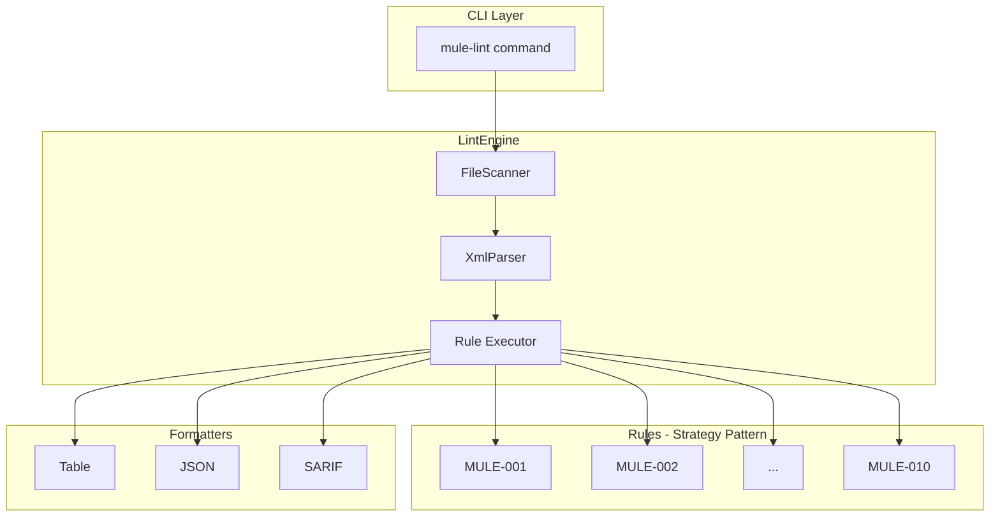
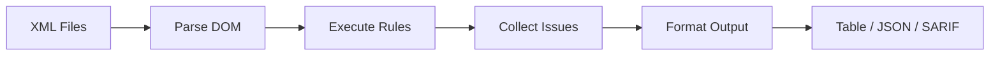

# Mule-Lint

<p align="center">
  <strong>Enterprise-grade static analysis tool for MuleSoft applications</strong>
</p>

<p align="center">
  <a href="#installation">Installation</a> •
  <a href="#quick-start">Quick Start</a> •
  <a href="#rules">Rules</a> •
  <a href="#output-formats">Output</a> •
  <a href="#configuration">Configuration</a> •
  <a href="#extending">Extending</a>
</p>

---

## Overview

**Mule-Lint** is a TypeScript-based linting tool designed to enforce best practices and standards for MuleSoft applications. It provides:

- ✅ **10+ Built-in Rules** covering error handling, naming conventions, security, and logging
- ✅ **Multiple Output Formats** - Table (human), JSON (scripts), SARIF (AI agents/VS Code)
- ✅ **CI/CD Ready** - Exit codes and machine-readable output
- ✅ **TypeScript** - Fully typed for VS Code extension integration
- ✅ **Extensible** - Add custom rules for your organization

### Architecture



### Data Flow




---

## Installation

```bash
# Global installation
npm install -g mule-lint

# Or as a dev dependency
npm install --save-dev mule-lint
```

---

## Quick Start

```bash
# Scan a directory
mule-lint ./src/main/mule

# Scan a single file
mule-lint ./src/main/mule/implementation.xml

# Output as JSON
mule-lint ./src/main/mule -f json

# Output as SARIF (for AI agents/VS Code)
mule-lint ./src/main/mule -f sarif > report.sarif

# Write to file
mule-lint ./src/main/mule -o report.txt

# Fail on warnings (for CI/CD)
mule-lint ./src/main/mule --fail-on-warning
```

### CLI Options

| Option | Description |
|--------|-------------|
| `-f, --format <type>` | Output format: `table`, `json`, `sarif` (default: `table`) |
| `-o, --output <file>` | Write output to file instead of stdout |
| `-c, --config <file>` | Path to configuration file |
| `-q, --quiet` | Show only errors (suppress warnings and info) |
| `-e, --experimental` | **Enable experimental rules (opt-in)** |
| `--fail-on-warning` | Exit with error code if warnings found |
| `-v, --verbose` | Show verbose output |

### Examples

```bash
# Basic scan
mule-lint .

# Scan with experimental rules
mule-lint . --experimental

# Output SARIF for VS Code
mule-lint src/main/mule -f sarif -o results.sarif
```

---

## Rules

### Core Rules (MVP)

| ID | Name | Severity | Category | Description |
|----|------|----------|----------|-------------|
| MULE-001 | Global Error Handler | Error | Error Handling | Project should have global error handler |
| MULE-002 | Flow Naming | Warning | Naming | Flows end with `-flow`, sub-flows with `-subflow` |
| MULE-003 | Missing Error Handler | Error | Error Handling | Flows should have error handlers |
| MULE-004 | Hardcoded URLs | Error | Security | Use property placeholders for URLs |
| MULE-005 | HTTP Status Check | Warning | Error Handling | Error handlers should set httpStatus |
| MULE-006 | Logger Category | Warning | Logging | Loggers should have category attribute |
| MULE-007 | Correlation ID | Warning | Error Handling | Error handlers should reference correlationId |
| MULE-008 | Choice Anti-Pattern | Warning | Standards | Avoid raise-error in otherwise |
| MULE-009 | Generic Error Type | Warning | Error Handling | Avoid catching type="ANY" |
| MULE-010 | DWL Standards | Info | Standards | Standard DataWeave files should exist |

### Extended Rules

| ID | Name | Severity | Category | Description |
|----|------|----------|----------|-------------|
| MULE-101 | Flow Casing | Warning | Naming | kebab-case for flows |
| MULE-102 | Variable Naming | Warning | Naming | camelCase for variables |
| MULE-201 | Hardcoded Credentials | Error | Security | Use `${secure::}` |
| MULE-202 | Insecure TLS | Error | Security | No insecure="true" |
| MULE-301 | Logger Payload | Warning | Logging | Don't log entire payload |
| MULE-303 | Logger in Retry | Warning | Logging | Avoid loggers in until-successful |
| MULE-401 | HTTP User-Agent | Warning | HTTP | Include User-Agent |
| MULE-402 | HTTP Content-Type | Warning | HTTP | POST/PUT needs Content-Type |
| MULE-403 | HTTP Timeout | Warning | HTTP | Set responseTimeout |
| MULE-501 | Scatter-Gather | Info | Performance | Limit parallel routes |
| MULE-502 | Async Error | Warning | Performance | Async needs error handling |
| MULE-503 | Large Choice | Warning | Performance | Max 7 when clauses |
| MULE-601 | Flow Description | Info | Documentation | Add doc:description |
| MULE-604 | Missing doc:name | Warning | Documentation | Key components need doc:name |
| MULE-701 | Deprecated | Warning | Standards | Detect deprecated elements |
| MULE-801 | Flow Complexity | Warning | Complexity | Cyclomatic complexity threshold |
| MULE-802 | Project Structure | Warning | Structure | Validate folder structure |
| MULE-803 | Global Config | Warning | Structure | global.xml should exist |
| MULE-804 | Monolithic XML | Warning | Structure | Split large XML files |

### DataWeave & API-Led Rules

| ID | Name | Severity | Category | Description |
|----|------|----------|----------|-------------|
| DW-001 | External DWL | Warning | DataWeave | Externalize complex transforms |
| DW-002 | DWL Naming | Info | DataWeave | kebab-case for .dwl files |
| DW-003 | DWL Modules | Info | DataWeave | Use common modules |
| API-001 | Experience Layer | Info | API-Led | Experience API patterns |
| API-002 | Process Layer | Info | API-Led | Process layer orchestration |
| API-003 | System Layer | Info | API-Led | System layer connections |

### Experimental Rules

| ID | Name | Severity | Category | Description |
|----|------|----------|----------|-------------|
| EXP-001 | Flow Ref Depth | Info | Experimental | Limit flow-ref chains |
| EXP-002 | Config Naming | Info | Experimental | Connector config naming |
| EXP-003 | MUnit Coverage | Info | Experimental | Check for MUnit tests |
| YAML-001 | Env Files | Warning | Standards | Environment YAML files |
| YAML-003 | Property Naming | Info | Standards | Property key format |
| YAML-004 | Plaintext Secrets | Error | Security | Encrypted secrets |

**Total: 41 rules** across 13 categories.

See [Rules Catalog](docs/rules-catalog.md) for detailed documentation.


---

## Output Formats

### Table (Default)

Human-readable colorized output:

```
Mule-Lint Report
Scanned 5 files in 123ms

src/main/mule/impl.xml
  45:0 error   Flow "getOrders" is missing an error handler (MULE-003)
  67:0 warning Logger is missing 'category' attribute (MULE-006)

Summary:
  Errors:     1
  Warnings:   1
  Infos:      0
```

### JSON

Machine-readable for scripting:

```json
[
  {
    "filePath": "/path/to/impl.xml",
    "line": 45,
    "message": "Flow \"getOrders\" is missing an error handler",
    "ruleId": "MULE-003",
    "severity": "error"
  }
]
```

### SARIF (For AI Agents)

[SARIF 2.1.0](https://sarifweb.azurewebsites.net/) format for VS Code, GitHub, and AI agents:

```json
{
  "$schema": "https://json.schemastore.org/sarif-2.1.0.json",
  "version": "2.1.0",
  "runs": [{
    "tool": {
      "driver": {
        "name": "mule-lint",
        "version": "1.0.0"
      }
    },
    "results": [...]
  }]
}
```

---

## Configuration

Create a `.mulelintrc.json` file in your project root:

```json
{
  "rules": {
    "MULE-001": { "enabled": true },
    "MULE-002": { 
      "enabled": true,
      "options": {
        "flowSuffix": "-flow",
        "subflowSuffix": "-subflow",
        "excludePatterns": ["*-api-main"]
      }
    },
    "MULE-006": { 
      "enabled": true,
      "severity": "error",
      "options": {
        "requiredPrefix": "com.myorg"
      }
    }
  },
  "include": ["src/main/mule/**/*.xml"],
  "exclude": ["**/test/**", "**/*.munit.xml"],
  "failOnWarning": false
}
```

---

## Using as a Library

Import directly into your TypeScript/JavaScript projects:

```typescript
import { LintEngine, ALL_RULES, formatSarif } from 'mule-lint';

// Create engine with all rules
const engine = new LintEngine({
    rules: ALL_RULES,
    config: {
        include: ['src/main/mule/**/*.xml'],
    },
});

// Scan a project
const report = await engine.scan('./my-mule-project');
console.log(formatSarif(report));

// Scan content directly (useful for VS Code extensions)
const issues = engine.scanContent(xmlContent, 'file.xml');
```

---

## Extending

### Adding Custom Rules

See [Extending Guide](docs/extending.md) for detailed instructions on creating custom rules.

```typescript
import { BaseRule, ValidationContext, Issue } from 'mule-lint';

export class MyCustomRule extends BaseRule {
    id = 'CUSTOM-001';
    name = 'My Custom Rule';
    description = 'Enforces my organization standards';
    severity = 'warning' as const;
    category = 'standards' as const;

    validate(doc: Document, context: ValidationContext): Issue[] {
        // Your validation logic using XPath
        const flows = this.select('//mule:flow', doc);
        // ...
    }
}
```

---

## Project Inspiration

This project is inspired by and builds upon the ideas from:

- **[mule-lint/mule-lint](https://github.com/mule-lint/mule-lint)** - The original Groovy-based MuleSoft linting tool with DSL-based rule definitions

While the original project uses Groovy and a custom DSL, this TypeScript implementation was created to:
- Enable easier VS Code extension integration
- Provide better AI agent compatibility via SARIF output
- Leverage the modern npm ecosystem
- Offer simpler CI/CD integration

---

## Documentation

| Document | Description |
|----------|-------------|
| [Architecture](docs/architecture.md) | System design and data flow |
| [Rules Catalog](docs/rules-catalog.md) | Complete list of all rules |
| [Extending](docs/extending.md) | How to add custom rules |
| [Naming Conventions](docs/naming-conventions.md) | Code style guide |

---

## Development

```bash
# Install dependencies
npm install

# Build
npm run build

# Run tests
npm test

# Lint
npm run lint
```

---

## Credits

<table>
  <tr>
    <td align="center">
      <strong>Built with AI Assistance</strong><br>
      This project was developed with the assistance of:<br><br>
      🚀 <strong>Antigravity</strong> (Google DeepMind)<br>
      🤖 <strong>GitHub Copilot</strong>
    </td>
  </tr>
</table>

---

## Contributing

Contributions are welcome! Please read the [Contributing Guide](CONTRIBUTING.md) for details.

---

## License

MIT © 2024