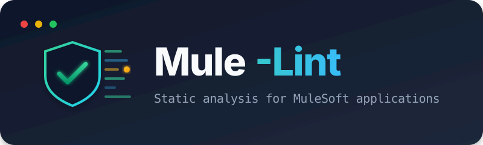

# Mule-Lint Documentation

Welcome to the Mule-Lint documentation. This documentation is organized into two sections: **MuleSoft Best Practices** (for integration developers and AI agents) and **Linter Technical Documentation** (for mule-lint contributors).

---

## 📘 MuleSoft Best Practices

Comprehensive guidelines for building maintainable, secure, and performant Mule 4 applications. Each guide is a focused, self-contained reference that can be read independently.

### Core Development

| Document                                                          | Description                                                                                         |
| ----------------------------------------------------------------- | --------------------------------------------------------------------------------------------------- |
| [Best Practices Index](best-practices/mulesoft-best-practices.md) | Master index with quick reference card and API-Led overview                                         |
| [Error Handling](best-practices/error-handling.md)                | Global error handlers, HTTP vs. event-driven patterns, connector error types, CRM error log objects |
| [Variable Contracts](best-practices/variable-contracts.md)        | Standard variables, correlation IDs, array mirroring, action routing                                |
| [Logging](best-practices/logging.md)                              | Categories, structured JSON logging, MDC/tracing, PII prevention                                    |
| [Security](best-practices/security.md)                            | Secure properties, TLS 1.2+, credentials, zero-trust architecture                                   |
| [Performance](best-practices/performance.md)                      | Timeouts, connection pooling, async error handling, streaming, bulk lookup (N+1 prevention)         |

### Architecture & Patterns

| Document                                                         | Description                                                                                      |
| ---------------------------------------------------------------- | ------------------------------------------------------------------------------------------------ |
| [Event-Driven Patterns](best-practices/event-driven-patterns.md) | Platform Events, Anypoint MQ, VM Queue Dispatcher, scheduler watermarking, deferred task polling |
| [Connector Patterns](best-practices/connector-patterns.md)       | Entity config YAML, SF/NS connector gotchas, protocol negotiation, ObjectStore caching           |
| [DataWeave Patterns](best-practices/dataweave-patterns.md)       | Modules, type coercion, cross-system value mapping (4 strategies), import path rules             |

### Project & Operations

| Document                                                             | Description                                                  |
| -------------------------------------------------------------------- | ------------------------------------------------------------ |
| [Folder Structure](best-practices/folder-structure.md)               | Standard Maven layout for Mule 4 projects                    |
| [Documentation Standards](best-practices/documentation-standards.md) | Flow documentation, README templates, commit messages        |
| [Testing (MUnit)](best-practices/testing.md)                         | Test structure, error scenario testing, event-driven testing |
| [CI/CD Integration](best-practices/ci-cd.md)                         | Pipeline stages, mule-lint integration, quality gates        |
| [Deployment & Modernization](best-practices/deployment-2026.md)      | CloudHub 2.0, Java 17, Anypoint Code Builder, API Governance |

### Reference

| Document                                         | Description                                            |
| ------------------------------------------------ | ------------------------------------------------------ |
| [Rules Catalog](best-practices/rules-catalog.md) | Complete reference for all 82 lint rules with examples |

---

## ⚙️ Using mule-lint

| Document                            | Description                                                  |
| ----------------------------------- | ------------------------------------------------------------ |
| [Configuration](configuration.md)   | `.mulelintrc.json` keys, precedence, per-rule options        |
| [Output formats](output-formats.md) | Table, JSON, SARIF, HTML, CSV, and what each exit code means |
| [Quality gates](quality-gates.md)   | Built-in and custom gates, plus the A–E rating formulas      |

---

## 🔧 Linter Technical Documentation

For contributors and those extending mule-lint.

| Document                                           | Description                                      |
| -------------------------------------------------- | ------------------------------------------------ |
| [Architecture](linter/architecture.md)             | System design, patterns, and data flow           |
| [Rule Engine](linter/rule-engine.md)               | Rule engine internals and interfaces             |
| [Extending](linter/extending.md)                   | How to create custom rules                       |
| [Folder Structure](linter/folder-structure.md)     | Linter project organization                      |
| [Naming Conventions](linter/naming-conventions.md) | Code style and naming standards                  |
| [MCP Design](mcp-design.md)                        | MCP server architecture and tool/resource design |

---

## Quick Start

### Installation

```bash
npm install -g @sfdxy/mule-lint
```

### Common Commands

```bash
# Scan with human-readable output
mule-lint ./src/main/mule

# Scan with JSON output
mule-lint ./src/main/mule -f json

# Scan with SARIF output for AI agents/IDEs
mule-lint ./src/main/mule -f sarif

# Generate HTML report
mule-lint ./src/main/mule -f html -o report.html

# Use config file
mule-lint ./src/main/mule -c .mulelintrc.json

# CI/CD: fail on warnings
mule-lint ./src/main/mule --fail-on-warning
```

### Exit Codes

| Code | Meaning                      |
| ---- | ---------------------------- |
| 0    | Success (no errors)          |
| 1    | Errors found                 |
| 2    | CLI/Configuration error      |
| 3    | Parse errors (malformed XML) |

---

## Rule Families

Counts are per identifier prefix, taken from the rule registry.

| Prefix   | Count | Covers                                             |
| -------- | ----- | -------------------------------------------------- |
| MULE-XXX | 29    | Core Mule 4 XML validation                         |
| SEC-XXX  | 8     | Secure properties, TLS, credentials, rate limiting |
| API-XXX  | 8     | API-Led and APIKit patterns                        |
| DW-XXX   | 5     | DataWeave file validation                          |
| HYG-XXX  | 5     | Code hygiene, unused flows and variables           |
| ERR-XXX  | 4     | Error handler structure and coverage               |
| YAML-XXX | 3     | YAML property configuration                        |
| OPS-XXX  | 3     | Auto-discovery, ports, externalized schedules      |
| EXP-XXX  | 3     | Experimental rules for evaluation                  |
| LOG-XXX  | 2     | Structured logging and sensitive data              |
| RES-XXX  | 2     | Reconnection and listener resilience               |
| CFG-XXX  | 2     | Configuration properties and environment parity    |
| PROJ-XXX | 2     | POM and Git hygiene                                |
| SF-XXX   | 2     | Salesforce and event connector rules               |
| HTTP-XXX | 1     | HTTP connector configuration                       |
| PERF-XXX | 1     | Connection pooling                                 |
| DOC-XXX  | 1     | Display names and documentation                    |
| STD-XXX  | 1     | Coding and API standards                           |

**Total: 82 rules** across 18 prefixes and 15 runtime categories. A prefix groups identifiers; a
category is the `category` field a rule reports, which is what configuration and quality gates filter
on. The two do not map one to one.

---

## For AI Agents

### MCP Resources

All best practice guides are available via the MuleSoft Lint MCP server:

```
mule-lint://rules                          → JSON catalog of all 82 rules
mule-lint://docs/best-practices            → Master index and quick reference
mule-lint://docs/error-handling            → Error handling patterns
mule-lint://docs/event-driven              → Event-driven architecture
mule-lint://docs/connectors                → Connector configuration
mule-lint://docs/variables                 → Variable contracts
mule-lint://docs/dataweave                 → DataWeave patterns
mule-lint://docs/security                  → Security best practices
mule-lint://docs/logging                   → Logging standards
mule-lint://docs/performance               → Performance optimization
mule-lint://docs/testing                   → MUnit testing
mule-lint://docs/deployment                → Deployment & modernization
mule-lint://docs/ci-cd                     → CI/CD integration
mule-lint://docs/folder-structure          → Project structure
mule-lint://docs/documentation-standards   → Documentation standards
mule-lint://docs/rules-catalog             → Complete rules reference
```

### SARIF Output

Use SARIF output for structured results:

```bash
mule-lint ./src/main/mule -f sarif > report.sarif
```

SARIF output follows the [SARIF 2.1.0 specification](https://sarifweb.azurewebsites.net/) with rule definitions, precise file locations, and fix suggestions.
