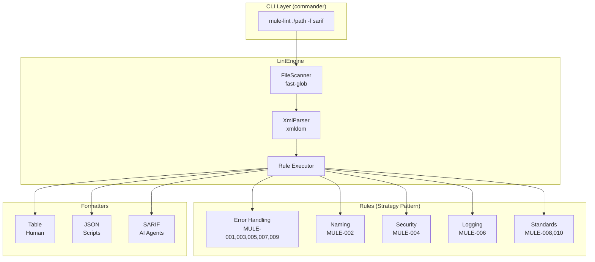
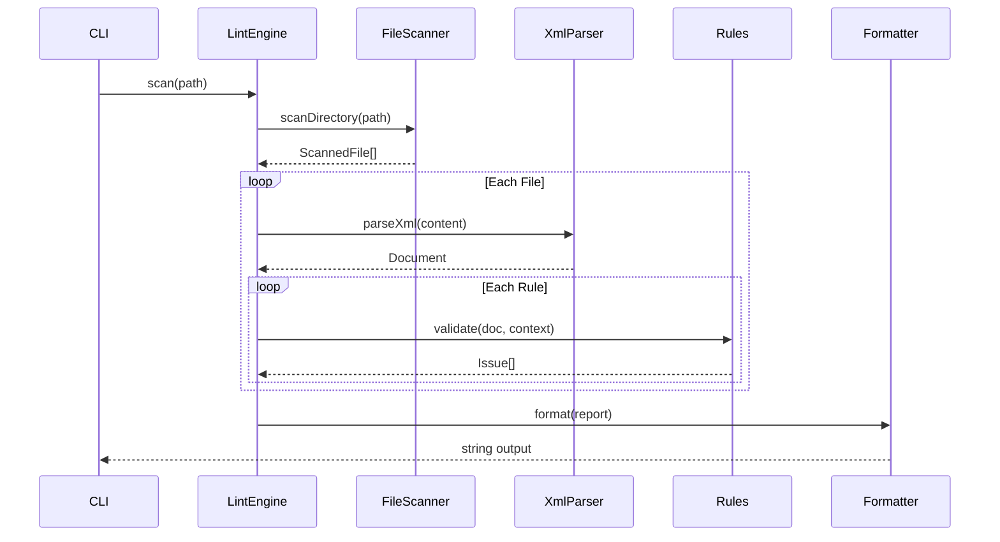
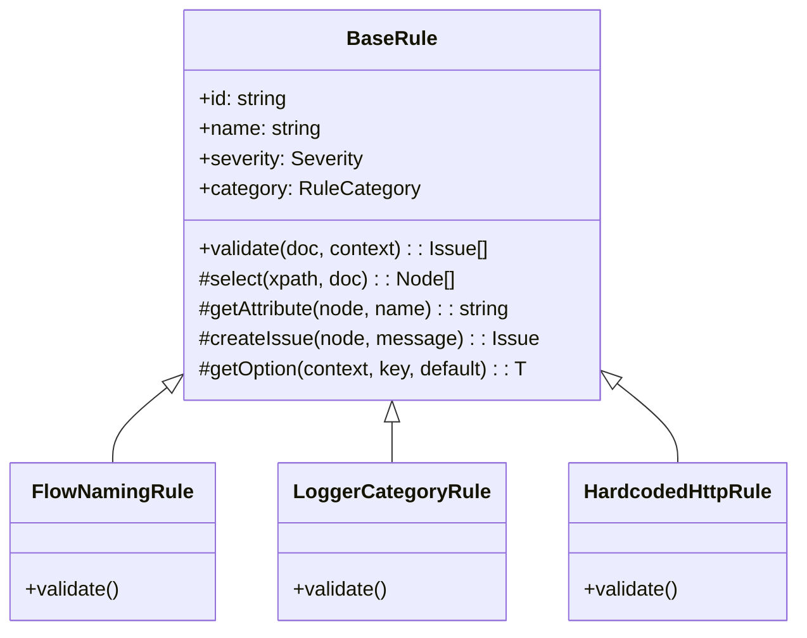

# Architecture

This document describes the architecture and design patterns used in mule-lint.

## System Overview



## Data Flow



## Core Components

### LintEngine

The central orchestrator that:
1. Scans directories for XML files using FileScanner
2. Parses each file with XmlParser
3. Executes all enabled rules against each document
4. Aggregates results into a LintReport

```typescript
const engine = new LintEngine({ rules: ALL_RULES, config });
const report = await engine.scan('./project');
```

### XPathHelper

Singleton utility for namespace-aware XPath queries:

```typescript
const xpath = XPathHelper.getInstance();
const flows = xpath.selectNodes('//mule:flow', document);
```

Pre-configured namespaces:

| Prefix | Namespace |
|--------|-----------|
| `mule` | http://www.mulesoft.org/schema/mule/core |
| `http` | http://www.mulesoft.org/schema/mule/http |
| `ee` | http://www.mulesoft.org/schema/mule/ee/core |
| `db` | http://www.mulesoft.org/schema/mule/db |
| `doc` | http://www.mulesoft.org/schema/mule/documentation |

### BaseRule

Abstract base class providing utilities to all rules:



## Design Patterns

### Strategy Pattern (Rules)

Each rule is a strategy implementing the same interface:

```typescript
interface Rule {
    id: string;
    name: string;
    severity: Severity;
    validate(doc: Document, context: ValidationContext): Issue[];
}
```

### Factory Pattern (Formatters)

Formatters are selected via factory function:

```typescript
function getFormatter(type: FormatterType): Formatter {
    switch (type) {
        case 'table': return formatTable;
        case 'json': return formatJson;
        case 'sarif': return formatSarif;
    }
}
```

### Singleton Pattern (XPathHelper)

XPathHelper uses singleton to avoid recreating namespace resolver:

```typescript
XPathHelper.getInstance(); // Same instance always
```

## Directory Structure

```
src/
├── index.ts              # Package entry point
├── types/                # TypeScript interfaces
│   ├── Rule.ts          # Rule, Issue, Severity
│   ├── Report.ts        # LintReport, FileResult
│   └── Config.ts        # LintConfig, CliOptions
├── core/                 # Core utilities
│   ├── XPathHelper.ts   # Namespace-aware XPath
│   ├── XmlParser.ts     # DOM parsing
│   └── FileScanner.ts   # File discovery
├── engine/               # Orchestration
│   └── LintEngine.ts    # Main engine
├── rules/                # All rules
│   ├── base/            # BaseRule
│   ├── error-handling/  # MULE-001, 003, 005, 007, 009
│   ├── naming/          # MULE-002
│   ├── security/        # MULE-004
│   ├── logging/         # MULE-006
│   └── standards/       # MULE-008, 010
└── formatters/           # Output formatters
    ├── TableFormatter.ts
    ├── JsonFormatter.ts
    └── SarifFormatter.ts
```

## Extension Points

### Adding Rules

1. Create class extending `BaseRule`
2. Implement `validate()` method
3. Register in `src/rules/index.ts`

### Adding Formatters

1. Create function implementing formatter interface
2. Add to factory in `src/formatters/index.ts`
3. Update `FormatterType` in types

## Error Handling

- **Parse Errors**: Captured and reported, don't stop scan
- **Rule Errors**: Caught and logged, continue with next rule
- **File Errors**: Reported in results, continue scanning
