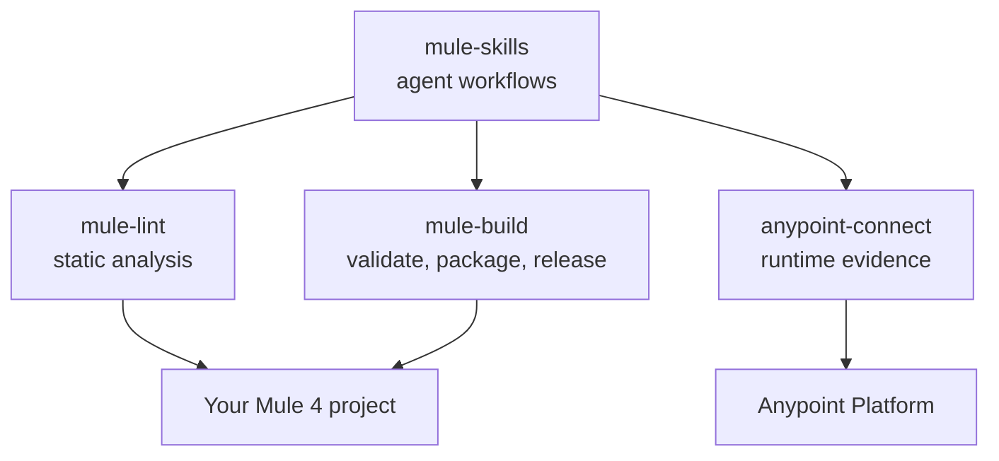

# Ecosystem

`mule-lint` is one of four independently versioned MuleSoft tools. The canonical package matrix,
supported combinations, host setup, and end-to-end agent workflows live in the
[mule-skills ecosystem hub](https://avinava.github.io/mule-skills/ecosystem/).

This page explains only the boundary of `mule-lint`: it owns the standards catalog, executable lint
rules, rule profiles, and the MCP resources that expose them. `mule-skills` composes those resources
with build and Anypoint Platform workflows; it does not copy or redefine the standards.

## How they fit

`mule-skills` is the workflow layer: it tells an agent how to document, review, or diagnose a Mule
project, and it calls the other three as tools. The three tools are useful on their own from a
terminal or a CI pipeline, with or without an agent.

## Using mule-lint through mule-skills

If you install `mule-skills`, `mule-lint` comes preconfigured as an MCP server with a pinned
version, so you do not need to set it up separately. The `mule-development`, `mule-review`, and
`mule-build` skills call it for static analysis. See
[the mule-skills MCP server reference](https://avinava.github.io/mule-skills/mcp-servers/).

To use `mule-lint` on its own, follow [the getting-started guide](getting-started.md).
