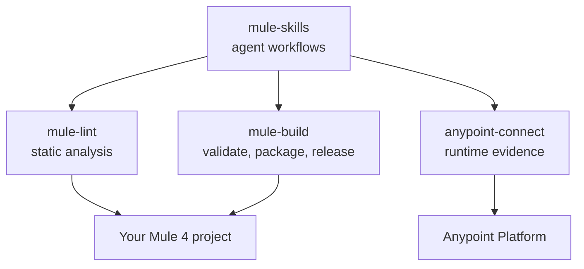

# Ecosystem

`mule-lint` is one of four MuleSoft tools that work together. Each is independent — use one, or all
of them.

| Project                                                           | Role                                                                                           | Credentials    | Documentation                                                        |
| ----------------------------------------------------------------- | ---------------------------------------------------------------------------------------------- | -------------- | -------------------------------------------------------------------- |
| [`mule-lint`](https://github.com/Avinava/mule-lint)               | Static analysis of Mule XML, DataWeave, YAML, and project structure                            | None           | this site                                                            |
| [`mule-build`](https://github.com/Avinava/mule-build)             | Validate, test, package, run locally, and release a Mule application                           | None           | [mule-build docs](https://avinava.github.io/mule-build/)             |
| [`anypoint-connect`](https://github.com/Avinava/anypoint-connect) | Authorized Anypoint Platform evidence and lifecycle operations                                 | Anypoint login | [anypoint-connect docs](https://avinava.github.io/anypoint-connect/) |
| [`mule-skills`](https://github.com/Avinava/mule-skills)           | Agent workflows for documentation, development, troubleshooting, operations, review, and build | None           | [mule-skills docs](https://avinava.github.io/mule-skills/)           |

## How they fit

`mule-skills` is the workflow layer: it tells an agent how to document, review, or diagnose a Mule
project, and it calls the other three as tools. The three tools are useful on their own from a
terminal or a CI pipeline, with or without an agent.

## Using mule-lint through mule-skills

If you install `mule-skills`, `mule-lint` comes preconfigured as an MCP server with a pinned
version, so you do not need to set it up separately. The `mule-development`, `mule-review`, and
`mule-build` skills call it for static analysis. See
[the mule-skills MCP server reference](https://avinava.github.io/mule-skills/mcp-servers/).

To use `mule-lint` on its own, follow [the installation instructions](README.md#quick-start).
