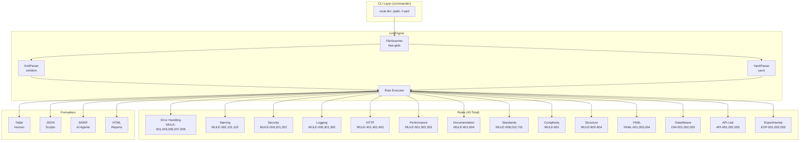
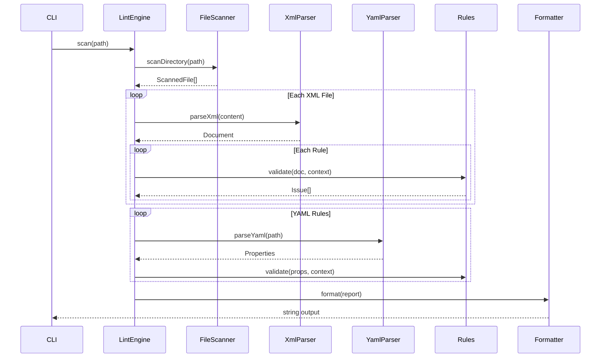
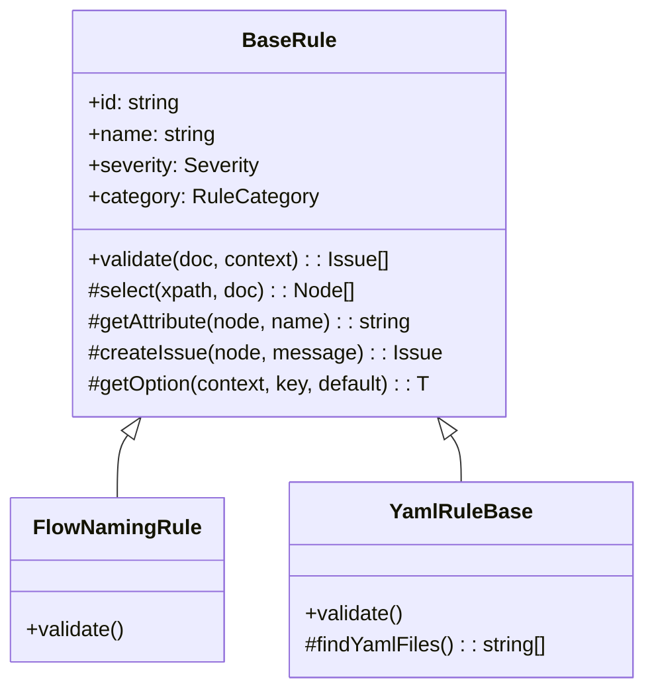

# Architecture

This document describes the architecture, design patterns, and best practices used in mule-lint.

## System Overview



## Data Flow



## Core Components

### LintEngine

The central orchestrator that:
1. Scans directories for XML and YAML files using FileScanner
2. Parses each file with XmlParser or YamlParser
3. Executes all enabled rules against each document
4. Aggregates results into a LintReport

```typescript
const engine = new LintEngine({ rules: ALL_RULES, config });
const report = await engine.scan('./project');
```

### XPathHelper

Singleton utility for namespace-aware XPath queries:

```typescript
const xpath = XPathHelper.getInstance();
const flows = xpath.selectNodes('//mule:flow', document);
```

Pre-configured namespaces:

| Prefix | Namespace |
|--------|-----------|
| `mule` | http://www.mulesoft.org/schema/mule/core |
| `http` | http://www.mulesoft.org/schema/mule/http |
| `ee` | http://www.mulesoft.org/schema/mule/ee/core |
| `db` | http://www.mulesoft.org/schema/mule/db |
| `doc` | http://www.mulesoft.org/schema/mule/documentation |
| `tls` | http://www.mulesoft.org/schema/mule/tls |
| `file` | http://www.mulesoft.org/schema/mule/file |
| `sftp` | http://www.mulesoft.org/schema/mule/sftp |
| `vm` | http://www.mulesoft.org/schema/mule/vm |
| `jms` | http://www.mulesoft.org/schema/mule/jms |
| `apikit` | http://www.mulesoft.org/schema/mule/mule-apikit |
| `batch` | http://www.mulesoft.org/schema/mule/batch |

### BaseRule

Abstract base class providing utilities to all rules:



## Design Patterns

### Strategy Pattern (Rules)

Each rule is a strategy implementing the same interface:

```typescript
interface Rule {
    id: string;
    name: string;
    severity: Severity;
    validate(doc: Document, context: ValidationContext): Issue[];
}
```

### Factory Pattern (Formatters)

Formatters are selected via factory function:

```typescript
function getFormatter(type: FormatterType): Formatter {
    switch (type) {
        case 'table': return formatTable;
        case 'json': return formatJson;
        case 'sarif': return formatSarif;
        case 'html': return formatHtml;
    }
}
```

### Singleton Pattern (XPathHelper)

XPathHelper uses singleton to avoid recreating namespace resolver:

```typescript
XPathHelper.getInstance(); // Same instance always
```

## Directory Structure

```
src/
├── index.ts              # Package entry point
├── types/                # TypeScript interfaces
│   ├── Rule.ts          # Rule, Issue, Severity
│   ├── Report.ts        # LintReport, FileResult
│   └── Config.ts        # LintConfig, CliOptions
├── core/                 # Core utilities
│   ├── XPathHelper.ts   # Namespace-aware XPath
│   ├── XmlParser.ts     # DOM parsing
│   ├── YamlParser.ts    # YAML parsing
│   ├── FileScanner.ts   # File discovery
│   └── ComplexityCalculator.ts
├── engine/               # Orchestration
│   └── LintEngine.ts    # Main engine
├── rules/                # All rules (40 total)
│   ├── index.ts         # Rule registry
│   ├── base/            # BaseRule class
│   ├── api-led/         # API-001, 002, 003
│   ├── complexity/      # MULE-801
│   ├── dataweave/       # DW-001, 002, 003
│   ├── documentation/   # MULE-601, 604
│   ├── error-handling/  # MULE-001, 003, 005, 007, 009
│   ├── experimental/    # EXP-001, 002, 003
│   ├── http/            # MULE-401, 402, 403
│   ├── logging/         # MULE-006, 301, 303
│   ├── naming/          # MULE-002, 101, 102
│   ├── performance/     # MULE-501, 502, 503
│   ├── security/        # MULE-004, 201, 202
│   ├── standards/       # MULE-008, 010, 701
│   ├── structure/       # MULE-802, 803, 804
│   └── yaml/            # YAML-001, 003, 004
└── formatters/           # Output formatters
    ├── TableFormatter.ts
    ├── JsonFormatter.ts
    ├── SarifFormatter.ts
    └── HtmlFormatter.ts
```

## Rule Categories

| Category | ID Prefix | Count | Description |
|----------|-----------|-------|-------------|
| Error Handling | MULE-00X | 5 | Error handler presence and configuration |
| Naming | MULE-002, 10X | 3 | Flow, variable, and file naming |
| Security | MULE-004, 20X | 3 | Hardcoded values and security |
| Logging | MULE-006, 30X | 3 | Logger configuration |
| HTTP | MULE-40X | 3 | HTTP request configuration |
| Performance | MULE-50X | 3 | Performance anti-patterns |
| Documentation | MULE-60X | 2 | Component documentation |
| Standards | MULE-008, 010, 70X | 3 | Best practices |
| Complexity | MULE-80X | 1 | Cyclomatic complexity |
| Structure | MULE-80X | 3 | Project structure |
| YAML | YAML-XXX | 3 | Properties validation |
| DataWeave | DW-XXX | 3 | DWL file validation |
| API-Led | API-XXX | 3 | API-Led patterns |
| Experimental | EXP-XXX | 3 | Beta rules |

## Extension Points

### Adding Rules

1. Create class extending `BaseRule`
2. Implement `validate()` method
3. Register in `src/rules/index.ts`
4. Add documentation to `docs/rules-catalog.md`

### Adding Formatters

1. Create function implementing formatter interface
2. Add to factory in `src/formatters/index.ts`
3. Update `FormatterType` in types

## Error Handling

- **Parse Errors**: Captured and reported, don't stop scan
- **Rule Errors**: Caught and logged, continue with next rule
- **File Errors**: Reported in results, continue scanning

## Performance Specifications

| Metric | Target |
|--------|--------|
| Files per second | > 100 |
| Memory per file | < 10MB |
| Rule execution | < 50ms per rule |
| Total for 100 files | < 5 seconds |

## Exit Codes

| Code | Meaning |
|------|---------|
| 0 | No errors or warnings |
| 1 | At least one error found |
| 2 | Configuration error |
| 3 | Critical error (parse failure) |
