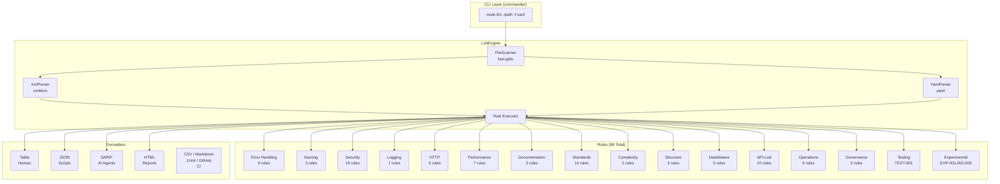
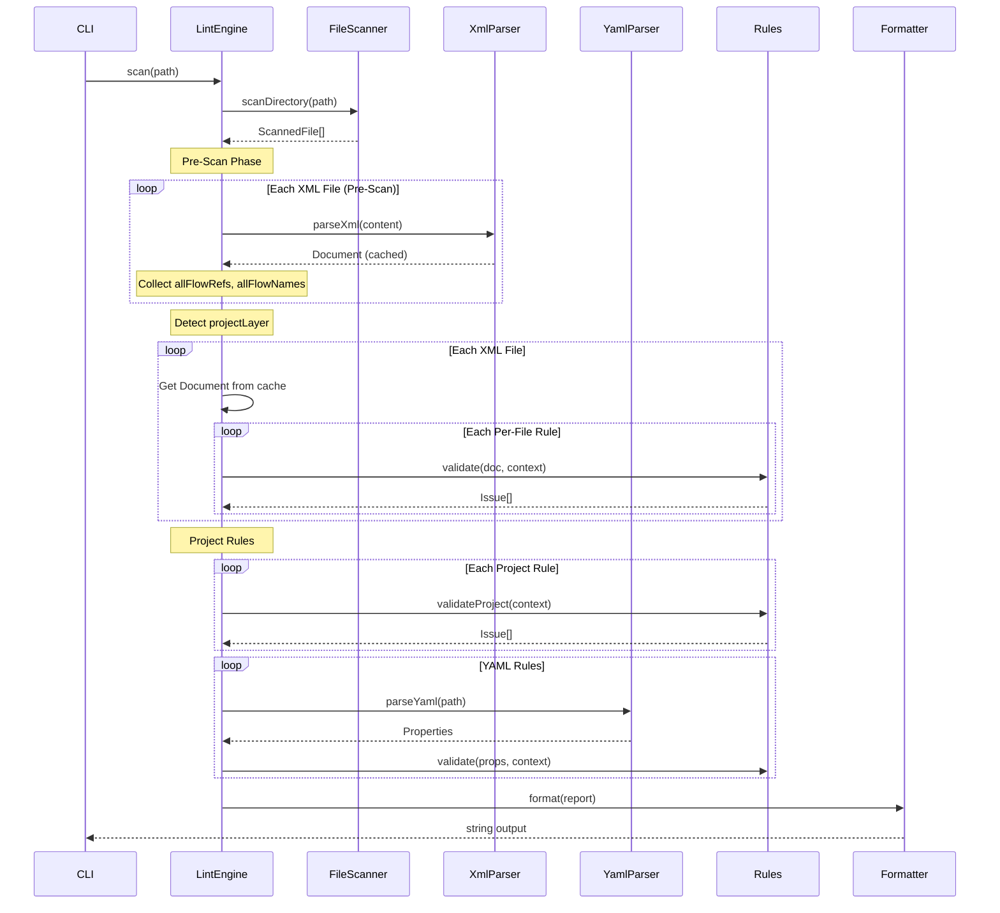
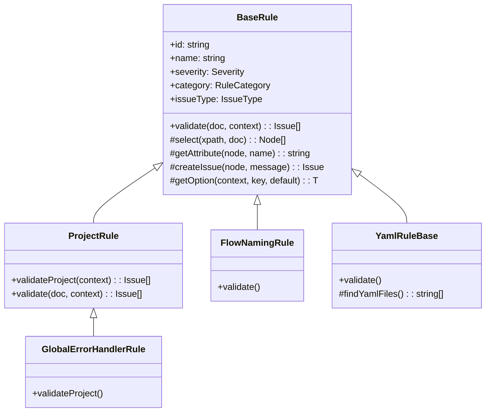

# Architecture

This document describes the architecture, design patterns, and best practices used in mule-lint.

## System Overview


```mermaid
flowchart TB
    subgraph CLI["CLI Layer (commander)"]
        A["mule-lint ./path -f sarif"]
    end

    subgraph Engine["LintEngine"]
        B[FileScanner<br/>fast-glob] --> C[XmlParser<br/>xmldom]
        C --> D[Rule Executor]
        B --> E[YamlParser<br/>yaml]
        E --> D
    end

    subgraph Rules["Rules (99 Total)"]
        D --> R1[Error Handling<br/>9 rules]
        D --> R2[Naming<br/>3 rules]
        D --> R3[Security<br/>19 rules]
        D --> R4[Logging<br/>7 rules]
        D --> R5[HTTP<br/>5 rules]
        D --> R6[Performance<br/>7 rules]
        D --> R7[Documentation<br/>3 rules]
        D --> R8[Standards<br/>14 rules]
        D --> R9[Complexity<br/>2 rules]
        D --> R10[Structure<br/>3 rules]
        D --> R11[DataWeave<br/>5 rules]
        D --> R12[API-Led<br/>10 rules]
        D --> R13[Operations<br/>6 rules]
        D --> R14[Governance<br/>2 rules]
        D --> R15[Testing<br/>TEST-001]
        D --> R16[Experimental<br/>EXP-001,002,003]
    end

    subgraph Output["Formatters"]
        J[Table<br/>Human]
        K[JSON<br/>Scripts]
        L[SARIF<br/>AI Agents]
        M[HTML<br/>Reports]
        N[CSV / Markdown<br/>JUnit / GitHub<br/>CI]
    end

    A --> B
    D --> J
    D --> K
    D --> L
    D --> M
```

## Data Flow


```mermaid
sequenceDiagram
    participant CLI
    participant Engine as LintEngine
    participant Scanner as FileScanner
    participant Parser as XmlParser
    participant YAML as YamlParser
    participant Rules
    participant Formatter

    CLI->>Engine: scan(path)
    Engine->>Scanner: scanDirectory(path)
    Scanner-->>Engine: ScannedFile[]

    Note over Engine: Pre-Scan Phase
    loop Each XML File (Pre-Scan)
        Engine->>Parser: parseXml(content)
        Parser-->>Engine: Document (cached)
        Note over Engine: Collect allFlowRefs, allFlowNames
    end
    Note over Engine: Detect projectLayer

    loop Each XML File
        Engine->>Engine: Get Document from cache
        loop Each Per-File Rule
            Engine->>Rules: validate(doc, context)
            Rules-->>Engine: Issue[]
        end
    end

    Note over Engine: Project Rules
    loop Each Project Rule
        Engine->>Rules: validateProject(context)
        Rules-->>Engine: Issue[]
    end

    loop YAML Rules
        Engine->>YAML: parseYaml(path)
        YAML-->>Engine: Properties
        Engine->>Rules: validate(props, context)
    end

    Engine->>Formatter: format(report)
    Formatter-->>CLI: string output
```

## Core Components

### LintEngine

The central orchestrator that:

1. Scans directories for XML and YAML files using FileScanner
2. **Pre-scans** all XML files to collect cross-file metadata (`allFlowRefs`, `allFlowNames`, `projectContext` with `projectLayer`)
3. **Caches** parsed XML `Document` objects to avoid redundant parsing
4. Executes all enabled per-file rules against each cached document
5. Executes project-level rules (`ProjectRule` subclasses) once per scan
6. Aggregates results into a LintReport

```typescript
const engine = new LintEngine({ rules: ALL_RULES, config });
const report = await engine.scan('./project');
```

#### Document Cache

During `preScanFiles()`, the engine parses each XML file and stores the resulting `Document` in an internal `Map<string, Document>`. When `processFile()` runs, it retrieves the cached document instead of re-parsing. The cache is cleared after each scan to free memory.

#### Project Layer Detection

The engine automatically classifies projects into a `ProjectLayer`:

| Layer     | Detection Heuristic                                         |
| --------- | ----------------------------------------------------------- |
| `sapi`    | Directory name contains `-sapi`, `-sys-`, or `-system-`     |
| `papi`    | Directory name contains `-papi`, `-proc-`, or `-process-`   |
| `eapi`    | Directory name contains `-eapi`, `-exp-`, or `-experience-` |
| `library` | Directory name contains `-library`, `-lib`, or `-common`    |
| `batch`   | Batch job elements detected in XML files                    |
| `unknown` | Default when no pattern matches                             |

Available to rules via `context.projectContext?.projectLayer`.

### XPathHelper

Singleton utility for namespace-aware XPath queries:

```typescript
const xpath = XPathHelper.getInstance();
const flows = xpath.selectNodes('//mule:flow', document);
```

Pre-configured namespaces:

| Prefix        | Namespace                                         |
| ------------- | ------------------------------------------------- |
| `mule`        | http://www.mulesoft.org/schema/mule/core          |
| `http`        | http://www.mulesoft.org/schema/mule/http          |
| `ee`          | http://www.mulesoft.org/schema/mule/ee/core       |
| `db`          | http://www.mulesoft.org/schema/mule/db            |
| `doc`         | http://www.mulesoft.org/schema/mule/documentation |
| `tls`         | http://www.mulesoft.org/schema/mule/tls           |
| `file`        | http://www.mulesoft.org/schema/mule/file          |
| `sftp`        | http://www.mulesoft.org/schema/mule/sftp          |
| `vm`          | http://www.mulesoft.org/schema/mule/vm            |
| `jms`         | http://www.mulesoft.org/schema/mule/jms           |
| `apikit`      | http://www.mulesoft.org/schema/mule/mule-apikit   |
| `batch`       | http://www.mulesoft.org/schema/mule/batch         |
| `netsuite`    | http://www.mulesoft.org/schema/mule/netsuite      |
| `sap`         | http://www.mulesoft.org/schema/mule/sap           |
| `anypoint-mq` | http://www.mulesoft.org/schema/mule/anypoint-mq   |
| `oauth`       | http://www.mulesoft.org/schema/mule/oauth         |

### BaseRule

Abstract base class providing utilities to all rules:


```mermaid
classDiagram
    class BaseRule {
        +id: string
        +name: string
        +severity: Severity
        +category: RuleCategory
        +issueType: IssueType
        +validate(doc, context): Issue[]
        #select(xpath, doc): Node[]
        #getAttribute(node, name): string
        #createIssue(node, message): Issue
        #getOption(context, key, default): T
    }

    class ProjectRule {
        +validateProject(context): Issue[]
        +validate(doc, context): Issue[]
    }

    class FlowNamingRule {
        +validate()
    }

    class YamlRuleBase {
        +validate()
        #findYamlFiles(): string[]
    }

    class GlobalErrorHandlerRule {
        +validateProject()
    }

    BaseRule <|-- FlowNamingRule
    BaseRule <|-- YamlRuleBase
    BaseRule <|-- ProjectRule
    ProjectRule <|-- GlobalErrorHandlerRule
```

**Issue Types for Quality Metrics:**

- `code-smell` (default) - Maintainability issues
- `bug` - Reliability issues (error-handling rules)
- `vulnerability` - Security issues (security rules)

## Design Patterns

### Strategy Pattern (Rules)

Each rule is a strategy implementing the same interface:

```typescript
interface Rule {
  id: string;
  name: string;
  severity: Severity;
  validate(doc: Document, context: ValidationContext): Issue[];
}
```

### Factory Pattern (Formatters)

Formatters are selected via factory function:

```typescript
function getFormatter(type: FormatterType): Formatter {
  switch (type) {
    case 'table':
      return formatTable;
    case 'json':
      return formatJson;
    case 'sarif':
      return formatSarif;
    case 'html':
      return formatHtml;
  }
}
```

### Singleton Pattern (XPathHelper)

XPathHelper uses singleton to avoid recreating namespace resolver:

```typescript
XPathHelper.getInstance(); // Same instance always
```

## Directory Structure

```
src/
├── index.ts              # Package entry point
├── types/                # TypeScript interfaces
│   ├── Rule.ts          # Rule, Issue, Severity, IssueType, ProjectLayer
│   ├── Report.ts        # LintReport, FileResult
│   └── Config.ts        # LintConfig, CliOptions
├── core/                 # Core utilities
│   ├── XPathHelper.ts   # Namespace-aware XPath (16 namespaces)
│   ├── XmlParser.ts     # DOM parsing
│   ├── YamlParser.ts    # YAML parsing
│   ├── FileScanner.ts   # File discovery
│   ├── ComplexityCalculator.ts
│   └── MetricsAggregator.ts  # Quality rating calculations
├── quality/              # Quality scoring system
│   ├── index.ts         # Module exports
│   ├── types.ts         # Rating types and interfaces
│   ├── thresholds.ts    # A-E rating boundaries
│   └── calculator.ts    # Rating calculation functions
├── engine/               # Orchestration
│   └── LintEngine.ts    # Main engine (document cache, pre-scan, project layer)
├── rules/                # All rules (99 total)
│   ├── index.ts         # Rule registry (ALL_RULES array)
│   ├── base/            # BaseRule + ProjectRule classes
│   ├── api-led/         # API-001–004, API-006–011
│   ├── complexity/      # MULE-801, MULE-805
│   ├── connector/       # SF-001, SF-002
│   ├── dataweave/       # DW-001–005
│   ├── documentation/   # MULE-601, 604, DOC-001
│   ├── error-handling/  # MULE-001,003,005,007,009, ERR-001–004
│   ├── experimental/    # EXP-001–003 (opt-in; EXP-003 is a deprecated alias)
│   ├── governance/      # PROJ-001, PROJ-002
│   ├── http/            # MULE-401–403, HTTP-004, HTTP-005
│   ├── logging/         # MULE-006,301,303, LOG-001,004,005, HYG-001
│   ├── naming/          # MULE-002, 101, 102
│   ├── operations/      # HYG-002–005, OPS-004, RES-003
│   ├── performance/     # MULE-501–503, PERF-002,003, RES-001–002
│   ├── security/        # MULE-004,201,202, SEC-002–016, CFG-003, YAML-004
│   ├── standards/       # MULE-008,010,701, OPS-001–003, API-005, CFG-001–002, STD-001
│   ├── structure/       # MULE-802–804
│   ├── testing/         # TEST-001
│   └── yaml/            # YAML-001, 003
└── formatters/           # Output formatters
    ├── TableFormatter.ts
    ├── JsonFormatter.ts
    ├── SarifFormatter.ts
    ├── CsvFormatter.ts
    ├── MarkdownFormatter.ts
    ├── GithubFormatter.ts
    ├── JunitFormatter.ts
    ├── HtmlFormatter.ts  # Orchestrates HTML report
    └── html/             # Modular HTML components
        ├── components/   # RatingBadge, Modal, etc.
        ├── sections/     # Header, Sidebar, QualityRatings
        ├── views/        # Dashboard, IssuesView
        ├── scripts/      # Client-side JS (renderer, router)
        └── styles/       # CSS modules and badges
```

## Rule Categories

| Runtime category | Count | Description                                            |
| ---------------- | ----- | ------------------------------------------------------ |
| error-handling   | 9     | Error handler configuration and best practices         |
| naming           | 3     | Flow, variable, and file naming                        |
| security         | 19    | Hardcoded values, TLS, transport, credentials, secrets |
| logging          | 7     | Logger configuration and hygiene                       |
| http             | 5     | HTTP request and listener configuration                |
| performance      | 7     | Performance anti-patterns and resilience               |
| documentation    | 3     | Component documentation                                |
| standards        | 14    | Best practices, operations, configuration, YAML        |
| complexity       | 2     | Cognitive complexity and flow size                     |
| structure        | 3     | Project structure                                      |
| dataweave        | 5     | DWL file validation                                    |
| api-led          | 10    | API-Led patterns, contracts, interface controls        |
| operations       | 6     | Runtime operability and connector behaviour            |
| governance       | 2     | POM and Git hygiene                                    |
| testing          | 1     | MUnit test presence                                    |
| experimental     | 3     | Opt-in rules for evaluation (`--experimental`)         |

A rule's ID prefix and its runtime category do not always agree (for example `YAML-001` is
`standards`, `CFG-003` is `security`). Profiles, config, and quality gates use the category.

## Glossary

Use these terms consistently in code, docs, and output.

| Term             | Meaning                                                                                           |
| ---------------- | ------------------------------------------------------------------------------------------------- |
| issue            | One lint result (`Issue`, the entries in JSON/SARIF). RAML/OpenAPI results are called _findings_. |
| `ruleId` / `id`  | `ruleId` on an issue or output record; `id` on a rule or catalog definition                       |
| `filePath`       | Absolute path of a scanned file                                                                   |
| `relativePath`   | Path relative to the scanned project root                                                         |
| rule profile     | `baseline`, `recommended`, or `strict`: which rules run                                           |
| contract ruleset | A local AMF Validation Profile passed to `api validate --ruleset`                                 |
| quality gate     | Pass/fail policy over the report (`--quality-gate`)                                               |
| rating threshold | The A–E bands used by quality ratings                                                             |
| `category`       | The topic a rule belongs to (`error-handling`, `security`, …)                                     |
| `issueType`      | `code-smell`, `bug`, or `vulnerability`, used by quality ratings                                  |
| experimental     | Opt-in rules in the `experimental` category; not part of any profile                              |

`src/formatter/` holds the Mule XML source formatter (`mule-lint format`). `src/formatters/` holds
the report output formatters (table, JSON, SARIF, HTML, CSV, Markdown, GitHub, JUnit).

## Extension Points

### Adding Rules

1. Create class extending `BaseRule`
2. Implement `validate()` method
3. Register in `src/rules/index.ts`
4. Add documentation to `docs/best-practices/rules-catalog.md`

### Adding Formatters

1. Create function implementing formatter interface
2. Add to factory in `src/formatters/index.ts`
3. Update `FormatterType` in types

## Error Handling

- **Parse Errors**: Captured and reported, don't stop scan
- **Rule Errors**: Caught and logged, continue with next rule
- **File Errors**: Reported in results, continue scanning

## Performance Specifications

| Metric              | Target          |
| ------------------- | --------------- |
| Files per second    | > 100           |
| Memory per file     | < 10MB          |
| Rule execution      | < 50ms per rule |
| Total for 100 files | < 5 seconds     |

## Exit Codes

| Code | Meaning                        |
| ---- | ------------------------------ |
| 0    | No errors or warnings          |
| 1    | At least one error found       |
| 2    | Configuration error            |
| 3    | Critical error (parse failure) |
