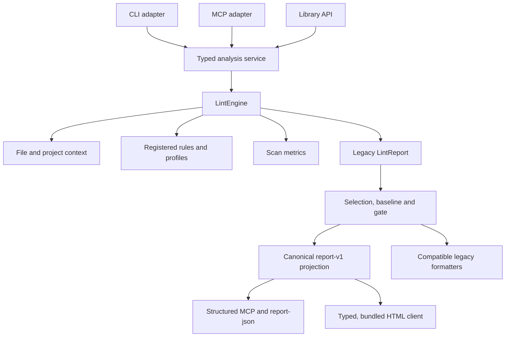

# Architecture

The analysis pipeline keeps transport, analysis policy, rule execution and presentation
separate while preserving existing CLI, library and MCP contracts.

## System Overview


```mermaid
flowchart TB
    CLI[CLI adapter] --> Service[Typed analysis service]
    MCP[MCP adapter] --> Service
    Library[Library API] --> Service
    Service --> Engine[LintEngine]
    Engine --> Scope[File and project context]
    Engine --> Rules[Registered rules and profiles]
    Engine --> Metrics[Scan metrics]
    Engine --> Report[Legacy LintReport]
    Report --> Selection[Selection, baseline and gate]
    Selection --> Contract[Canonical report-v1 projection]
    Contract --> Structured[Structured MCP and report-json]
    Selection --> Legacy[Compatible legacy formatters]
    Contract --> HTML[Typed, bundled HTML client]
```

The [analysis decision](../decisions/analysis-pipeline.md) records compatibility boundaries.
The exported schema drives the [generated contract reference](../generated/report-contract.md).

## Data Flow

1. The adapter supplies an explicit target and request options. Configuration is loaded only
   when requested; unknown keys retain warning semantics.
2. The service resolves the rule set, profile and formatter selection. CLI defaults and MCP's
   recommended default remain deliberately distinct.
3. The engine discovers selected files, gathers context, executes rules and aggregates metrics.
4. The service applies quiet selection, then a baseline, then a quality gate. Execution health
   is independent of finding selection and cannot become a pass through filtering.
5. The service returns the report, canonical contract, effective rules, messages and exit policy.
   Adapters own transport, report file writes and process exit.
6. Legacy formatters remain compatible projections. HTML and structured consumers use canonical
   findings; existing JSON continues to be a flat issue array.

A complete execution is not whole-project coverage. A file target gathers selected-file context
and may also run project checks. The recorded target, profile, enabled rules and patterns must
be interpreted together. Unknown legacy scope remains explicit.

## Core Components

### AnalysisService

`analyze()` owns request/configuration, selection, baseline and gate policy. It does not print
normal report output, write report files or exit the process. Optional message callbacks let
adapters present configuration diagnostics. Verbose engine output retains stderr behavior.

A caller may provide rules or a configured engine. An injected engine supplies its actual enabled
rule metadata; conflicting rule/config/profile requests are rejected. Scan configuration is
inherited, while formatter, warning-exit and gate policy remain explicit service options.

### LintEngine

The engine owns file discovery, parsing, cross-file context, execution and metrics. Rule IDs,
profile memberships and meanings are stable API. Engine internals are not being rewritten as
part of the service extraction.

#### Document Cache

Documents are cached during a scan and released afterward. A per-engine queue serializes scans
so mutable caches and rule-error collections cannot leak between concurrent callers. Removing
that queue requires separate per-run isolation and concurrency characterization.

#### Project Layer Detection

Project context includes heuristic layer classification and cross-file flow facts. Rules consume
that context rather than independently rescanning the repository. Heuristics do not establish
architectural correctness; see the [rule engine](rule-engine.md) for execution details.

### XPathHelper

The namespace-aware XPath helper centralizes Mule connector namespaces and source locations.
Custom declarative rules use the same helper and are excluded from built-in quality ratings.

### BaseRule

Per-file rules implement `Rule`/`BaseRule`; project checks extend `ProjectRule`. Catalog metadata
supplies standards, profiles and documentation links. `issueType` drives heuristic quality
calculations; it is independent of category and severity. A parse diagnostic is not a code smell.

## Design Patterns

### Strategy Pattern (Rules)

Rules implement a common validation interface and run against engine-provided context. New rules
must update registration, catalog metadata, tests and the canonical executable reference together.

### Factory Pattern (Formatters)

`format(report, type, rules)` selects the compatible output adapter. Canonical projection is
centralized in `createReportContract`; formatters do not decide whether an incomplete scan passed.

### Singleton Pattern (XPathHelper)

The shared XPath namespace registry remains unchanged. Its lifetime is distinct from per-scan
engine caches and execution diagnostics.

## Directory Structure

```text
bin/                       CLI and MCP entry adapters
src/core/AnalysisService   Shared request and result policy
src/core/ReportContract    Versioned schema and canonical projection
src/engine/                Discovery/context/execution/metrics orchestration
src/rules/                 Registered rule implementations
src/catalog/               Standards, profiles and rule metadata
src/mcp/                   MCP tools, resources and prompts
src/formatters/            Compatible report output adapters
src/formatters/html/client Typed browser modules bundled into one report
src/formatter/             XML source formatting, a separate capability
src/api-contract/          RAML/OpenAPI validation, a separate capability
scripts/                   Build and generated-reference drift checks
```

## Rule Categories

Counts and built-in profile membership come from the
[generated registry reference](../generated/rule-reference.md). The
[rules catalog](../best-practices/rules-catalog.md) owns rule meanings and reviewed guidance.
An ID prefix need not match its runtime category; do not infer semantics from a prefix alone.

## Glossary

- **Issue/finding:** an observed rule result; legacy JSON uses issue records, report-v1 uses findings.
- **Execution:** whether the requested scan completed, independently of findings or a gate.
- **Scope:** the actual target, effective profile/rules and file-selection patterns.
- **Selection:** quiet filtering and baseline provenance applied to a scan.
- **Quality gate:** a pass/warn/fail policy over eligible complete results.
- **Rating:** a heuristic estimate, not a release or security guarantee.
- **Relative path:** location within the resolved project root; stable between nested file and project scans.

## Extension Points

### Adding Rules

Follow the [extending guide](extending.md), preserve stable IDs and update executable/catalog
parity tests. Generate mechanical metadata; author explanatory guidance and reviewed standards.

### Adding Formatters

Preserve report-v1 and flat JSON contracts. Add an adapter, expose its formatter name deliberately,
and cover parse/rule/no-files diagnostics, escaping and exit behavior before adding examples.

## Error Handling

Parse and rule failures remain visible even when ordinary findings are filtered or baselined.
Rule failures, parse failures and no-files outcomes take precedence over findings and gates.
MCP may return a fatal tool error without a report when analysis cannot start; absence of a
structured report is not an empty successful scan.

## Performance Specifications

Performance targets require measured fixtures. Retain project pre-scan caching and avoid repeated
rule-level filesystem walks. Characterize large-report rendering and scan behavior before claiming
throughput or memory guarantees; architecture alone does not establish those measurements.

## Exit Codes

The [CLI reference](../cli-reference.md#exit-codes) owns exact exit-code precedence.
The shared service returns that decision; adapters do not independently reimplement it.

## Documentation ownership

- Runtime schema/catalog/profile definitions own generated mechanical references.
- This package owns analysis semantics, rules and MCP resources. Bundled docs cannot be shadowed
  by similarly named files in an unrelated caller working directory.
- The [ecosystem hub](https://avinava.github.io/mule-skills/ecosystem/) owns package pins and
  consumer capability expectations. Build owns local artifacts; the platform connector owns
  authorized platform operations. Independent releases and package boundaries remain intact.
