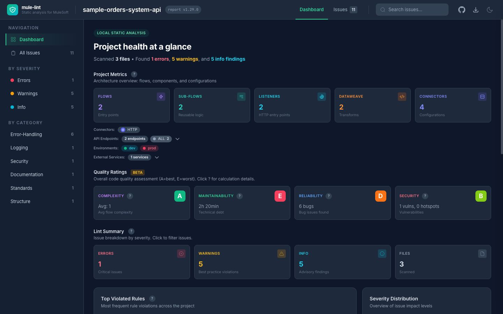
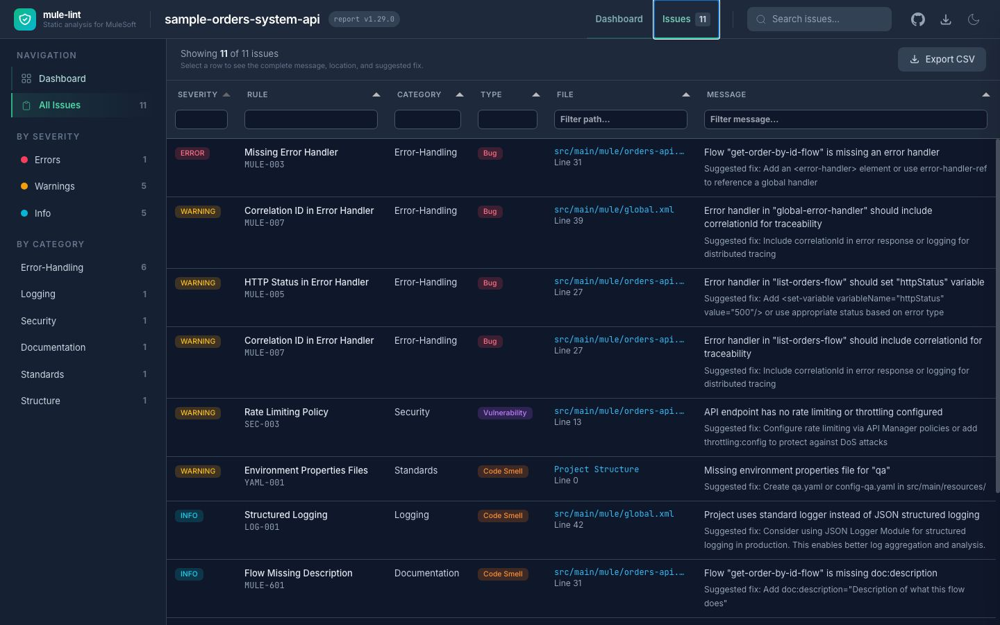

# Output formats

Choose an output for the person or system consuming the result. The rules and findings do not change with the format.

| Format         | Option           | Best for                            |
| -------------- | ---------------- | ----------------------------------- |
| Terminal table | `--format table` | Local developer work                |
| HTML           | `--format html`  | Visual review and sharing           |
| SARIF          | `--format sarif` | Pull-request and editor annotations |
| JSON           | `--format json`  | Scripts and integrations            |
| CSV            | `--format csv`   | Spreadsheet review                  |

## Terminal table

```bash
mule-lint . --profile recommended
```

```text
Mule-Lint Report
Scanned 3 files in 46ms

src/main/mule/orders-api.xml
  31:5  error  Flow "get-order-by-id-flow" is missing an error handler (MULE-003)

Project Structure
  0:0   warning  Missing environment properties file for "qa" (YAML-001)

Summary:
  Errors:    1
  Warnings:  5
  Infos:     5
```

Add `--quiet` to print only errors.

## HTML

```bash
mule-lint . --profile recommended --format html --output mule-lint-report.html
```

The report provides:

- project metrics and quality ratings;
- charts for severity, categories, and frequently violated rules;
- an issue table with search and column filters;
- a complete issue-detail panel when you select a row;
- CSV export and light/dark themes.





The lint data is embedded in the file. Interactive styling, charts, fonts, and the issue table load from public CDNs, so the browser needs network access.

## JSON

JSON is a flat array with one object per finding:

```bash
mule-lint . --profile recommended --format json --output mule-lint-report.json
```

```json
[
  {
    "filePath": "src/main/mule/orders-api.xml",
    "line": 32,
    "column": 5,
    "message": "Flow \"get-order-by-id-flow\" is missing an error handler",
    "ruleId": "MULE-003",
    "severity": "error"
  }
]
```

Do not expect a top-level summary object in this format.

## SARIF

```bash
mule-lint . --profile recommended --format sarif --output mule-lint.sarif
```

SARIF 2.1.0 includes rule metadata, locations, and suggestions. Use it for GitHub code scanning, compatible editors, and agent tooling. See [CI/CD integration](best-practices/ci-cd.md).

## CSV

```bash
mule-lint . --profile recommended --format csv --output mule-lint.csv
```

```csv
Severity,Rule,File,Line,Column,Message
error,MULE-003,src/main/mule/orders-api.xml,31,5,"Flow ""get-order-by-id-flow"" is missing an error handler"
```

## Exit codes

The format controls what is printed. The exit code controls automation.

| Code | Meaning                                                           |
| ---- | ----------------------------------------------------------------- |
| `0`  | No errors and no failed gate                                      |
| `1`  | Errors found, warnings configured to fail, or quality gate failed |
| `2`  | Command or configuration problem                                  |
| `3`  | Source parse error                                                |

Warnings and info findings are visible without failing a normal run. See [quality gates](quality-gates.md) to change the pass/fail policy.
