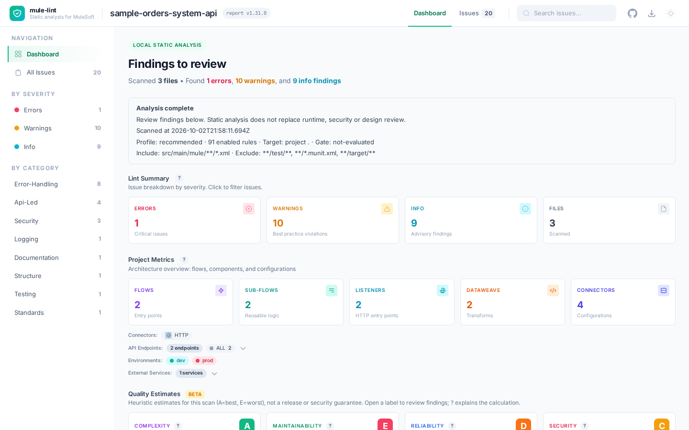
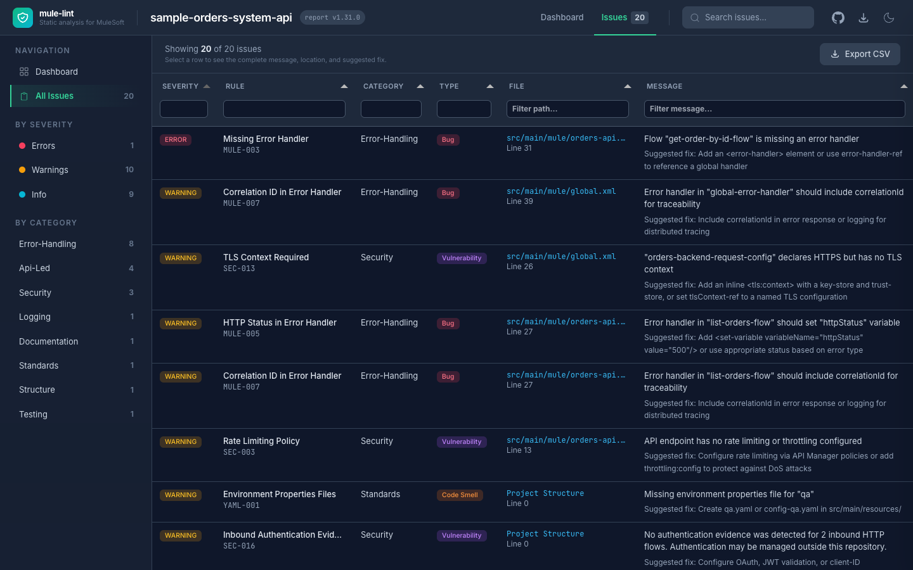

# Output formats

Choose an output for the person or system consuming the result. The rules and findings do not change with the format.

| Format         | Option                 | Best for                                 |
| -------------- | ---------------------- | ---------------------------------------- |
| Terminal table | `--format table`       | Local developer work                     |
| HTML           | `--format html`        | Visual review and sharing                |
| SARIF          | `--format sarif`       | Pull-request and editor annotations      |
| Report JSON    | `--format report-json` | Versioned execution and finding contract |
| JSON           | `--format json`        | Scripts and integrations                 |
| CSV            | `--format csv`         | Spreadsheet review                       |
| Markdown       | `--format markdown`    | Pull-request comments, job summaries     |
| GitHub         | `--format github`      | Inline annotations in GitHub Actions     |
| JUnit XML      | `--format junit`       | Generic CI test-report viewers           |

Only the report is written to standard output. Quality-gate results, `--verbose` details, and the
"Report written to" message go to standard error, so `--format json | jq` and piped SARIF stay valid.
An unknown `--format` stops with exit code `2` before the scan runs.

## Terminal table

```bash
mule-lint . --profile recommended
```

```text
Mule-Lint Report
Scanned 3 files in 46ms

src/main/mule/orders-api.xml
  31:5  error  Flow "get-order-by-id-flow" is missing an error handler (MULE-003)

Project Structure
  0:0   warning  Missing environment properties file for "qa" (YAML-001)

Summary:
  Errors:    1
  Warnings:  10
  Infos:     9
```

Add `--quiet` to print only errors.

## HTML

```bash
mule-lint . --profile recommended --format html --output mule-lint-report.html
```

The report provides:

- project metrics and quality ratings;
- charts for severity, categories, and frequently violated rules;
- an issue table with search and column filters;
- a complete issue-detail panel when you select a row;
- CSV export and light/dark themes.





The report embeds its data, typed client, styling, charts, table code and fonts in one HTML
file. Open it locally without network access; report loading makes no HTTP(S) requests.
Documentation links open only when selected. This offline behavior is an unreleased addition;
reports generated by older installed releases may still require CDN access.

`--format html` without `--output` writes `report.html` in the current directory. Missing output directories are created. Files that fail to parse appear in the issue table as `PARSE-ERROR`.

## JSON

JSON is a flat array with one object per finding:

```bash
mule-lint . --profile recommended --format json --output mule-lint-report.json
```

```json
[
  {
    "filePath": "/home/dev/orders-api/src/main/mule/orders-api.xml",
    "relativePath": "src/main/mule/orders-api.xml",
    "line": 32,
    "column": 5,
    "message": "Flow \"get-order-by-id-flow\" is missing an error handler",
    "ruleId": "MULE-003",
    "severity": "error"
  }
]
```

`filePath` is absolute and `relativePath` is relative to the scanned project. Entries can also carry `suggestion` and `codeSnippet`. Do not expect a top-level summary object in this format.

## Versioned report JSON

```bash
mule-lint . --profile recommended --format report-json --output analysis.json
```

Use `report-json` for automation that must distinguish an empty finding list from an
unsuccessful analysis. It returns a versioned object; `--format json` remains the compatible
flat issue array, and the library's `formatJsonFull` retains its existing shape.

Version 1 contains:

- `schemaVersion: 1` and `tool.name` / `tool.version`;
- `execution.status`: `complete`, `incomplete` (parse or rule failures), or `no-files`, plus
  typed `execution.diagnostics`;
- `scan`: timestamp, duration, effective profile, enabled rule IDs, include/exclude patterns,
  and the file or project target relative to the project root. `scopeKnown: false` means an
  older library caller did not provide scope; empty arrays then mean unknown, not fully checked.
  `target: null` means the target was not recorded. A null profile means no named profile was recorded;
- `selection`: quiet mode and baseline counts when applied;
- `gate`: `not-evaluated`, `passed`, `warning`, or `failed`;
- `summary` and deterministically ordered `findings`, including parse-error findings.

Each finding contains severity, rule ID, message, `muleLint/v1` fingerprint, duplicate
`occurrence`, and an explicit file or project `location`. Project findings have no synthetic
line zero. Available catalog standards, documentation links, and remediation are included;
confidence and evidence are not invented. Fingerprints retain the existing rule/path/message
identity (line shifts do not change them); occurrence distinguishes duplicates within a report.
Summary finding counts reflect the current selection. Execution diagnostics cannot be hidden
by quiet mode, a baseline, or permissive gate thresholds.

Library consumers can import `reportSchema` and `createReportContract` from `@sfdxy/mule-lint`.
Validate the version before consuming the object; version 1 may gain additive fields.
Check execution status before interpreting findings or gate results. A complete scan means
its selected analysis finished, not that the whole system is secure or correct.

### Baseline: report only new issues

Save a JSON report once, then pass it back to see only what changed:

```bash
mule-lint . --profile recommended --format json --output baseline.json
mule-lint . --profile recommended --baseline baseline.json
```

Issues are matched by rule, file, and message, so moving code up or down a file does not make an
old issue look new. The command prints `Baseline: N new, N unchanged, N fixed` to standard error.
The report and quality gate then consider only new findings. Parse and rule execution failures
and no-file scans still fail, even when the baseline removes every ordinary finding. Commit `baseline.json` to
adopt mule-lint on an existing project without fixing everything first.

## Versioned report JSON

```bash
mule-lint . --profile recommended --format report-json --output analysis.json
```

This opt-in object has `schemaVersion: 1`. Existing `--format json` remains a flat array and is still the input format for `--baseline`.

- `execution.status` is `complete`, `incomplete`, or `no-files`. Check it before interpreting an empty findings array; diagnostics describe parse errors, failed rules, and missing source files.
- `scan` records the timestamp, duration, effective profile, enabled rule IDs, include/exclude patterns, and relative file or project target. `scopeKnown: false` marks legacy library reports whose scope was not supplied.
- `selection` records quiet mode and baseline counts. It does not suppress execution diagnostics.
- `gate.status` is `not-evaluated`, `passed`, `warning`, or `failed`. Incomplete and no-file scans cannot pass a gate.
- `summary` counts emitted findings, including parse diagnostics. `findings` are deterministically ordered and include relative file locations or explicit project scope, rule/severity/message, available remediation and catalog references.
- Each finding retains the `muleLint/v1` fingerprint and a one-based `occurrence` for duplicates. Severity is not a confidence score; the report does not invent confidence or evidence.

Library consumers can validate the object with the exported `reportSchema` and create it with `createReportContract`. Version 1 permits additive fields; consumers should reject unsupported major schema versions and avoid treating unknown scope as a complete project assessment.

## SARIF

```bash
mule-lint . --profile recommended --format sarif --output mule-lint.sarif
```

SARIF 2.1.0 includes rule metadata with a link to each rule's catalog entry, locations, a stable
fingerprint per result so code scanning can de-duplicate alerts across runs, and the fix suggestion in
each result's `properties.suggestion`. Execution failures set `executionSuccessful: false` and include tool execution notifications. Project-level findings, such as a missing file, have no
location. Incomplete and no-file scans set `executionSuccessful: false` and include
`toolExecutionNotifications`. Use it for GitHub code scanning, compatible editors, and agent tooling. See [CI/CD integration](best-practices/ci-cd.md).

## CSV

```bash
mule-lint . --profile recommended --format csv --output mule-lint.csv
```

```csv
Severity,Rule,File,Line,Column,Message
error,MULE-003,src/main/mule/orders-api.xml,31,5,"Flow ""get-order-by-id-flow"" is missing an error handler"
```

Cells that begin with `=`, `+`, `-`, `@`, a tab, or a carriage return are prefixed with `'` so
spreadsheet applications do not evaluate them as formulas.

## Markdown, GitHub annotations, and JUnit

```bash
mule-lint . --profile recommended --format markdown >> "$GITHUB_STEP_SUMMARY"
mule-lint . --profile recommended --format github
mule-lint . --profile recommended --format junit --output mule-lint-junit.xml
```

- **Markdown** prints a summary line and a table of up to 100 issues, errors first.
- **GitHub** prints `::error`, `::warning`, and `::notice` workflow commands that Actions turns into annotations on the pull-request diff.
- **JUnit** writes one test suite per file. Errors and warnings are failed test cases; info findings are passing cases.

## Exit codes

The format controls what is printed. The exit code controls automation.

| Code | Meaning                                                                    |
| ---- | -------------------------------------------------------------------------- |
| `0`  | Complete scan with no failing finding or gate condition                    |
| `1`  | Errors found, warnings configured to fail, or quality gate failed          |
| `2`  | Command/configuration failure, rule execution failure, or no scanned files |
| `3`  | Source parse error                                                         |

Warnings and info findings are visible without failing a normal run. See [quality gates](quality-gates.md) to change the pass/fail policy.

Execution failures take precedence over finding and gate results: rule failure (`2`), then
parse failure (`3`), then no files (`2`), then ordinary findings or gate results (`0`/`1`).
This also applies with `--quiet`, `--baseline`, and permissive custom gates. Diagnostics are
written to stderr, so a legacy JSON `[]` alone is never proof of a successful scan.

Execution failures take precedence over finding thresholds and permissive gates: rule failures use `2`, otherwise parse failures use `3`, otherwise no source files uses `2`. Quiet mode and baselines cannot turn these into success. Flat JSON has no execution envelope, so also inspect its exit status and standard error.
