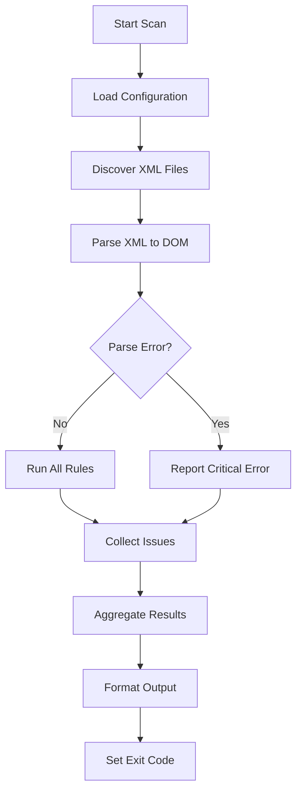

# Rule Engine Documentation

> **Version:** 1.0.0  
> **Purpose:** Comprehensive guide to the mule-lint rule engine internals, extensibility, and best practices.

---

## Overview

The Rule Engine is the heart of mule-lint. It orchestrates:

1. **Discovery** - Finding XML files to analyze
2. **Parsing** - Converting XML to queryable DOM
3. **Validation** - Running rules against the DOM
4. **Reporting** - Aggregating and formatting results

---

## Core Interfaces

### Rule Interface

Every rule must implement this contract:

```typescript
import { Document } from '@xmldom/xmldom';

export type Severity = 'error' | 'warning' | 'info';

export type RuleCategory = 
    | 'naming'
    | 'error-handling'
    | 'security'
    | 'logging'
    | 'standards'
    | 'performance'
    | 'documentation';

export interface Issue {
    line: number;
    column?: number;
    message: string;
    ruleId: string;
    severity: Severity;
    suggestion?: string;     // Optional fix suggestion
    codeSnippet?: string;    // Relevant code context
}

export interface ValidationContext {
    filePath: string;        // Absolute path to file
    relativePath: string;    // Path relative to project root
    projectRoot: string;     // Project root directory
    config: RuleConfig;      // Rule-specific configuration
}

export interface Rule {
    // Unique identifier (e.g., "MULE-001")
    id: string;
    
    // Human-readable name
    name: string;
    
    // Detailed description for documentation
    description: string;
    
    // Default severity (can be overridden by config)
    severity: Severity;
    
    // Category for grouping in reports
    category: RuleCategory;
    
    // Optional: documentation URL
    docsUrl?: string;
    
    // The validation function
    validate(doc: Document, context: ValidationContext): Issue[];
}
```

### RuleConfig Interface

Per-rule configuration:

```typescript
export interface RuleConfig {
    enabled: boolean;
    severity?: Severity;        // Override default
    options?: Record<string, unknown>;  // Rule-specific options
}
```

---

## Base Rule Class

All rules should extend `BaseRule` for common utilities:

```typescript
import { Document, Node } from '@xmldom/xmldom';
import { Rule, Issue, Severity, RuleCategory, ValidationContext } from '@types';
import { XPathHelper } from '@core/XPathHelper';

export abstract class BaseRule implements Rule {
    abstract id: string;
    abstract name: string;
    abstract description: string;
    abstract severity: Severity;
    abstract category: RuleCategory;
    
    docsUrl?: string;
    
    protected xpath = XPathHelper.getInstance();
    
    abstract validate(doc: Document, context: ValidationContext): Issue[];
    
    // --- Utility Methods ---
    
    /**
     * Execute XPath and return matching nodes
     */
    protected select(expression: string, doc: Document): Node[] {
        return this.xpath.select(expression, doc);
    }
    
    /**
     * Create an issue with consistent formatting
     */
    protected createIssue(
        node: Node,
        message: string,
        options?: {
            suggestion?: string;
            severity?: Severity;
        }
    ): Issue {
        return {
            line: this.getLineNumber(node),
            column: this.getColumnNumber(node),
            message,
            ruleId: this.id,
            severity: options?.severity ?? this.severity,
            suggestion: options?.suggestion,
        };
    }
    
    /**
     * Get line number from node (xmldom stores this)
     */
    protected getLineNumber(node: Node): number {
        // xmldom stores line info in columnNumber/lineNumber
        return (node as any).lineNumber ?? 1;
    }
    
    /**
     * Get column number from node
     */
    protected getColumnNumber(node: Node): number | undefined {
        return (node as any).columnNumber;
    }
    
    /**
     * Check if a node has a specific attribute
     */
    protected hasAttribute(node: Node, attrName: string): boolean {
        const element = node as Element;
        return element.hasAttribute?.(attrName) ?? false;
    }
    
    /**
     * Get attribute value from node
     */
    protected getAttribute(node: Node, attrName: string): string | null {
        const element = node as Element;
        return element.getAttribute?.(attrName) ?? null;
    }
}
```

---

## XPath Reference for MuleSoft

### Namespace Map

```typescript
const MULE_NAMESPACES = {
    'mule': 'http://www.mulesoft.org/schema/mule/core',
    'http': 'http://www.mulesoft.org/schema/mule/http',
    'https': 'http://www.mulesoft.org/schema/mule/https',
    'ee': 'http://www.mulesoft.org/schema/mule/ee/core',
    'doc': 'http://www.mulesoft.org/schema/mule/documentation',
    'tls': 'http://www.mulesoft.org/schema/mule/tls',
    'db': 'http://www.mulesoft.org/schema/mule/db',
    'file': 'http://www.mulesoft.org/schema/mule/file',
    'sftp': 'http://www.mulesoft.org/schema/mule/sftp',
    'vm': 'http://www.mulesoft.org/schema/mule/vm',
    'jms': 'http://www.mulesoft.org/schema/mule/jms',
    'apikit': 'http://www.mulesoft.org/schema/mule/mule-apikit',
    'api-gateway': 'http://www.mulesoft.org/schema/mule/api-gateway',
    'secure-properties': 'http://www.mulesoft.org/schema/mule/secure-properties',
    'os': 'http://www.mulesoft.org/schema/mule/os',
    'batch': 'http://www.mulesoft.org/schema/mule/batch',
};
```

### Common XPath Patterns

| Purpose | XPath Expression |
|---------|------------------|
| All flows | `//mule:flow` |
| All sub-flows | `//mule:sub-flow` |
| Flow by name | `//mule:flow[@name='my-flow']` |
| All loggers | `//mule:logger` |
| Loggers without category | `//mule:logger[not(@category)]` |
| All error handlers | `//mule:error-handler` |
| All on-error blocks | `//mule:on-error-continue \| //mule:on-error-propagate` |
| All HTTP listeners | `//http:listener` |
| All HTTP requests | `//http:request` |
| Choice blocks | `//mule:choice` |
| DataWeave transforms | `//ee:transform` |
| Set-variable | `//mule:set-variable` |
| Flows without error handler | `//mule:flow[not(mule:error-handler)]` |
| Attributes starting with http | `//*[@*[starts-with(., 'http:')]]` |

---

## Rule Implementation Examples

### Example 1: Flow Naming Rule

```typescript
import { Document, Node } from '@xmldom/xmldom';
import { BaseRule, Issue, ValidationContext } from '@types';

export class FlowNamingRule extends BaseRule {
    id = 'MULE-002';
    name = 'Flow Naming Convention';
    description = 'Flows must end with "-flow", sub-flows with "-subflow"';
    severity = 'warning' as const;
    category = 'naming' as const;
    
    validate(doc: Document, context: ValidationContext): Issue[] {
        const issues: Issue[] = [];
        
        // Check flows
        const flows = this.select('//mule:flow', doc);
        for (const flow of flows) {
            const name = this.getAttribute(flow, 'name');
            if (name && !name.endsWith('-flow')) {
                issues.push(this.createIssue(
                    flow,
                    `Flow "${name}" should end with "-flow"`,
                    { suggestion: `Rename to "${name}-flow"` }
                ));
            }
        }
        
        // Check sub-flows
        const subflows = this.select('//mule:sub-flow', doc);
        for (const subflow of subflows) {
            const name = this.getAttribute(subflow, 'name');
            if (name && !name.endsWith('-subflow')) {
                issues.push(this.createIssue(
                    subflow,
                    `Sub-flow "${name}" should end with "-subflow"`,
                    { suggestion: `Rename to "${name}-subflow"` }
                ));
            }
        }
        
        return issues;
    }
}
```

### Example 2: Logger Category Rule

```typescript
import { Document, Node } from '@xmldom/xmldom';
import { BaseRule, Issue, ValidationContext } from '@types';

export class LoggerCategoryRule extends BaseRule {
    id = 'MULE-006';
    name = 'Logger Category Required';
    description = 'All loggers must have a category attribute for proper log filtering';
    severity = 'warning' as const;
    category = 'logging' as const;
    
    validate(doc: Document, context: ValidationContext): Issue[] {
        const issues: Issue[] = [];
        
        const loggers = this.select('//mule:logger[not(@category)]', doc);
        
        for (const logger of loggers) {
            const message = this.getAttribute(logger, 'message') || 'unknown';
            issues.push(this.createIssue(
                logger,
                `Logger is missing 'category' attribute`,
                { 
                    suggestion: `Add category="com.myorg.${context.relativePath.replace(/\//g, '.')}"` 
                }
            ));
        }
        
        return issues;
    }
}
```

### Example 3: Hardcoded HTTP Rule (Security)

```typescript
import { Document, Node, Element } from '@xmldom/xmldom';
import { BaseRule, Issue, ValidationContext } from '@types';

export class HardcodedHttpRule extends BaseRule {
    id = 'MULE-004';
    name = 'Hardcoded HTTP URLs';
    description = 'HTTP/HTTPS URLs should use properties, not hardcoded values';
    severity = 'error' as const;
    category = 'security' as const;
    
    private readonly URL_PATTERN = /^https?:\/\//i;
    private readonly ALLOWED_PATTERNS = [
        /\$\{[^}]+\}/,  // Property placeholders ${...}
        /\#\[[^\]]+\]/,  // DataWeave expressions #[...]
    ];
    
    validate(doc: Document, context: ValidationContext): Issue[] {
        const issues: Issue[] = [];
        
        // Find all elements with attributes containing http:// or https://
        const allElements = doc.getElementsByTagName('*');
        
        for (let i = 0; i < allElements.length; i++) {
            const element = allElements[i];
            const attrs = element.attributes;
            
            for (let j = 0; j < attrs.length; j++) {
                const attr = attrs[j];
                const value = attr.value;
                
                if (this.URL_PATTERN.test(value) && !this.isAllowedPattern(value)) {
                    issues.push(this.createIssue(
                        element,
                        `Hardcoded URL "${this.truncate(value)}" found in attribute "${attr.name}"`,
                        { 
                            suggestion: 'Use property placeholder: ${http.url}' 
                        }
                    ));
                }
            }
        }
        
        return issues;
    }
    
    private isAllowedPattern(value: string): boolean {
        return this.ALLOWED_PATTERNS.some(pattern => pattern.test(value));
    }
    
    private truncate(value: string, maxLen = 50): string {
        return value.length > maxLen ? value.substring(0, maxLen) + '...' : value;
    }
}
```

---

## Rule Registration

Rules are registered in `src/rules/index.ts`:

```typescript
import { Rule } from '@types';

// Import all rules
import { FlowNamingRule } from './naming/FlowNamingRule';
import { GlobalErrorHandlerRule } from './error-handling/GlobalErrorHandlerRule';
import { MissingErrorHandlerRule } from './error-handling/MissingErrorHandlerRule';
import { HardcodedHttpRule } from './security/HardcodedHttpRule';
import { HttpStatusRule } from './error-handling/HttpStatusRule';
import { LoggerCategoryRule } from './logging/LoggerCategoryRule';
import { CorrelationIdRule } from './error-handling/CorrelationIdRule';
import { ChoiceAntiPatternRule } from './standards/ChoiceAntiPatternRule';
import { GenericErrorRule } from './error-handling/GenericErrorRule';
import { DwlStandardsRule } from './standards/DwlStandardsRule';

// Rule registry
export const RULES: Rule[] = [
    new FlowNamingRule(),
    new GlobalErrorHandlerRule(),
    new MissingErrorHandlerRule(),
    new HardcodedHttpRule(),
    new HttpStatusRule(),
    new LoggerCategoryRule(),
    new CorrelationIdRule(),
    new ChoiceAntiPatternRule(),
    new GenericErrorRule(),
    new DwlStandardsRule(),
];

// Export for external use
export * from './naming/FlowNamingRule';
export * from './error-handling/GlobalErrorHandlerRule';
// ... etc
```

---

## Engine Processing Flow



---

## Configuration

### `.mulelintrc.json` Schema

```json
{
  "$schema": "./node_modules/mule-lint/config-schema.json",
  "rules": {
    "MULE-001": { "enabled": true, "severity": "error" },
    "MULE-002": { "enabled": true, "severity": "warning" },
    "MULE-003": { 
      "enabled": true, 
      "options": {
        "excludePatterns": ["*-api-main"]
      }
    }
  },
  "include": ["src/main/mule/**/*.xml"],
  "exclude": ["**/test/**", "**/*.munit.xml"],
  "formatters": {
    "default": "table",
    "ci": "sarif"
  }
}
```

### Rule-Specific Options

Some rules support additional options:

| Rule | Option | Type | Default | Description |
|------|--------|------|---------|-------------|
| MULE-002 | `flowSuffix` | string | `-flow` | Expected flow name suffix |
| MULE-002 | `subflowSuffix` | string | `-subflow` | Expected sub-flow suffix |
| MULE-003 | `excludePatterns` | string[] | `[]` | Flow name patterns to exclude |
| MULE-006 | `requirePrefix` | string | `null` | Required category prefix |

---

## Testing Rules

### Test Structure

```typescript
import { FlowNamingRule } from '../rules/naming/FlowNamingRule';
import { parseXml } from '../core/XmlParser';

describe('FlowNamingRule', () => {
    const rule = new FlowNamingRule();
    
    it('should pass for correctly named flow', () => {
        const xml = `
            <mule xmlns="http://www.mulesoft.org/schema/mule/core">
                <flow name="my-process-flow">
                    <logger message="test"/>
                </flow>
            </mule>
        `;
        const doc = parseXml(xml);
        const issues = rule.validate(doc, mockContext);
        
        expect(issues).toHaveLength(0);
    });
    
    it('should fail for incorrectly named flow', () => {
        const xml = `
            <mule xmlns="http://www.mulesoft.org/schema/mule/core">
                <flow name="myProcess">
                    <logger message="test"/>
                </flow>
            </mule>
        `;
        const doc = parseXml(xml);
        const issues = rule.validate(doc, mockContext);
        
        expect(issues).toHaveLength(1);
        expect(issues[0].ruleId).toBe('MULE-002');
        expect(issues[0].message).toContain('myProcess');
    });
});
```

---

## Performance Specifications

| Metric | Target |
|--------|--------|
| Files per second | > 100 |
| Memory per file | < 10MB |
| Rule execution | < 50ms per rule |
| Total for 100 files | < 5 seconds |

---

## Exit Codes

| Code | Meaning |
|------|---------|
| 0 | No errors or warnings |
| 1 | At least one error found |
| 2 | Configuration error |
| 3 | Critical error (parse failure) |
